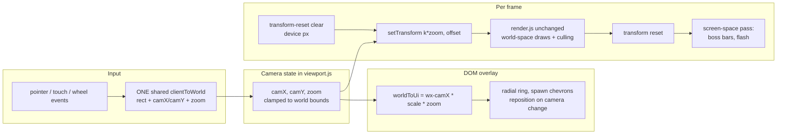
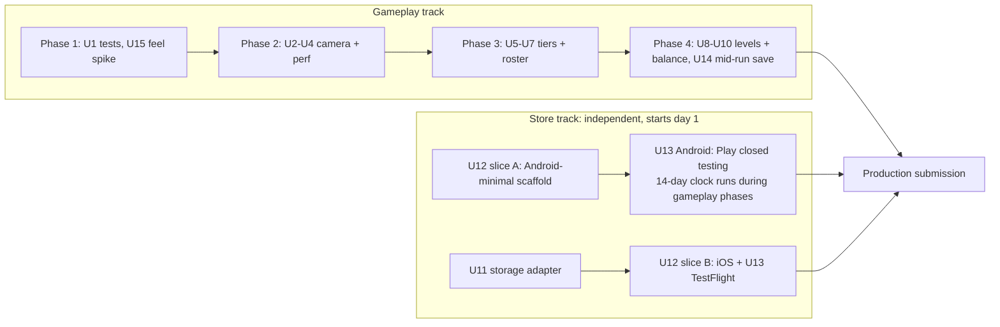

# WC3-Scale Progression Revision + Capacitor Mobile Ship

## Summary

Rebuild Mazecore TD's progression to match the classic WC3 tower-defense rhythm: tight early gold, a "barely survive, reinvest, briefly ahead" loop, bigger boards behind a pan/zoom camera, a new 8-tower roster with 5-tier upgrades where each tier unlocks a capability, and 20 campaign levels scaling from 10 waves to a near-impossible 100-wave finale. Ship the result to Google Play and the Apple App Store as a Capacitor 8 wrap of this existing web game. The store track is split so its longest pole, Google Play's closed-testing gate (12 testers for 14 consecutive days), starts on day 1 with the current build while the gameplay revision proceeds in parallel.

---

## Problem Frame

The game is feature-complete and balanced to its old contract, but the progression feel is wrong: mobs are too easy at the start and gold is oversupplied. Root cause (verified in research): `WAVECLEAR_BASE/PER_WAVE` and `BOUNTY_PER_WAVE` in `src/config.js` were Phase-8-tuned for the 100-wave classic board and apply unscaled to tiny campaign levels. Level 1 pays roughly 1,400g total (waveclear + bounties + interest + early-start) on a 7x9 board where a cannon costs 15g. There is no scarcity, so there is no strategy.

Beyond the tuning bug, the design target has changed. The user wants the classic WC3 TD shape: bigger mazes (the reference points at 60x70 grids and 150-250 cell paths), a wider roster with distinct roles (splash, slow, poison, sniper, chain, support, income), 5 upgrade tiers where power roughly doubles per tier and each tier adds a mechanic rather than just numbers, and a campaign whose 20 levels grow from 10 waves to 100 waves with difficulty that ends close to impossible.

Platform target also changed: Android AND iOS. This kills the Google AI Studio native-rebuild path (Android-only, cannot wrap web code) recorded in `HANDOFF-NATIVE-REBUILD.md`. Decision made with the user in this session: revise this web game and wrap with Capacitor. The native-rebuild handoff gets shelved (U8 updates the doc).

---

## Requirements

- R1: Early game is tight. Levels 1-3 force real spend decisions; a careless player leaks by mid-campaign.
- R2: Gold economy follows the WC3 model: kills pay small bounties (1-5g class enemies, 25-100g bosses), missing kills hurts, wave-clear bonuses scale with the level, not with global constants.
- R3: Boards grow beyond the screen. A pan/zoom camera (pinch + drag on touch, wheel + drag on desktop) with the whole UI staying correct under it.
- R4: New 8-tower roster (plus the 5g Wall) with the roles from the reference: arrow, cannon (splash), frost (slow), poison (DoT), sniper (single-target nuke), lightning (chain), support (aura), gold (income). User provides sprite assets.
- R5: 5 upgrade tiers per tower, cost/power roughly doubling per tier (T1 1x, T2 2.5x, T3 5x, T4 10x, T5 20x), with a capability unlock at T3 and a signature mechanic at T5. The existing A/B specialization fork (today's L4 fork on the hidden legacy towers) moves to T5.
- R6: 20 campaign levels, wave counts scaling from 10 (level 1) to 100 (level 20), progressively harder, endgame close to impossible: the reference (competent) sim build clears every level but with margins that shrink to near-zero on levels 18-20; the careless build dies early. Long levels are survivable in real life: mid-run progress persists across app kills (U14).
- R7: The game ships to both stores via Capacitor 8: portrait-locked, fully offline, saves durable against iOS WebView eviction, audio working on iOS, safe areas respected.
- R8: All balance changes are verified through the headless sim gates, which get promoted into the repo (currently gitignored in `scratch/`).

---

## Key Technical Decisions

- **KTD1: Camera is a transform, not a rewrite.** The whole renderer draws in world px behind a single `viewport.applyTransform(ctx)` call (`src/main.js`, one call site). The camera extends that transform to `setTransform(k*zoom, 0, 0, k*zoom, -camX*k*zoom, -camY*k*zoom)`. Render code stays untouched except for the handful of draws that must become screen-space (boss bars, damage flash, and the device-space frame clear).
- **KTD2: Unify the duplicate input mapping first.** `src/engine/input.js` has its own client-to-world math independent of `viewport.clientToWorld`. Both assume the canvas box equals the whole world. The camera lands in exactly one shared mapping or hover/click coordinates will silently disagree.
- **KTD3: 5 tiers as per-tier data tables, reusing the fork merge loop.** `getTowerStats` already folds arbitrary capability mods (splash, chain, slow, dot, shatter, aura...) from branch definitions onto the stats object. Tier definitions become `def.tiers[level]` entries using the same mod merge (the merge gains a cooldown-multiplier mod key, which branch mods lack today). Six-plus hardcoded "3/4" sites (tower.js, shop.js, radial.js, both sims) convert to data-driven caps.
- **KTD4: Retune through per-level multipliers, never globals.** `level.waves.hpMult` is already set by all 20 current levels (0.5 through 4.4) and applied to every spawn; `bountyMult` and `countMult` are read by the wave composer but unset in level data; a `waveclearMult` gets added beside them. Global constants (`DIFFICULTY`, `DAMAGE_SCALE`, `WAVECLEAR_*`, `BOUNTY_*`) stay untouched so the classic-board Endless gates stay green independently.
- **KTD5: New roster is mostly un-hiding, not greenfield.** The hidden legacy towers (archer, frost, venom, tesla, beacon) already implement arrow/frost/poison/lightning/support with L4 forks. Sniper is pure data (hitscan + long range + long cooldown). Only four mechanics need new code: income-per-wave, execute-below-threshold, armor-shred debuff, and line-pierce. Stun-on-hit is ~2 lines (enemy side exists). Knockback is explicitly rejected: it fights the distance-field walker.
- **KTD6: Capacitor 8, staged static `webDir`, plugins via the injected global.** No bundler gets introduced, but `webDir` cannot be the repo root: the generated `android/` and `ios/` projects live inside the repo, and `cap sync` cannot copy a directory into its own subdirectory (and the bundle must not ship `.git`, `docs/`, `node_modules`, or `scratch/`). An npm `stage` script copies the runtime files (`index.html`, `manifest.webmanifest`, `src/`, `assets/`) into a gitignored `www/` and `webDir` points there; staging is a file copy, not a build step, and browser dev keeps serving the repo root directly. Plugins (Preferences, SystemBars) are called through `window.Capacitor?.Plugins.X` behind feature detection so the same code keeps running in a plain browser.
- **KTD7: Saves move behind a storage adapter with a Preferences mirror.** Official Capacitor guidance: iOS reclaims WebView localStorage under disk pressure. Adapter writes localStorage (sync, in-session) plus Preferences (durable, async); boot reads Preferences first, one-time-migrates existing localStorage keys. In a plain browser the adapter is localStorage-only.
- **KTD8: The Play clock starts day 1, decoupled from everything.** Google Play's new-personal-account gate (12 opted-in testers, 14 consecutive days of closed testing) starts counting only when a build is live, and the current game is already shippable to testers. U12 is therefore split: an Android-minimal slice with zero dependencies ships to Play closed testing immediately; the iOS leg (which actually needs the storage adapter and audio work) follows. iOS builds run on Codemagic's free macOS tier (cert generation without a Mac); Windows stays the only dev machine.
- **KTD9: v1 ships offline, ad-free, no analytics.** Minimizes App Store 4.2/2.5.2 review risk (fully bundled game is an explicitly permitted pattern under guideline 4.7) and keeps both privacy forms at "no data collected". The existing simulated-ads layer stays simulated; AdMob (`@capacitor-community/admob`) is a later plan.

---

## High-Level Technical Design

### Camera transform pipeline



### Tier system shape (directional, not implementation spec)

```
CONFIG.TOWERS.<id> = {
  cost, damageType, ...baseStats,          // T1
  tiers: [                                  // T2..T5, applied cumulatively
    { costMult: 2.5,  mods: {...} },        // T2: better range / atk speed
    { costMult: 5,    mods: {...} },        // T3: first capability (splash+, slow+, chain+)
    { costMult: 10,   mods: {...} },        // T4: stronger effect / multi-target
    { costMult: 20,   forks: { A: {...}, B: {...} } },  // T5: signature, A/B choice
  ],
}
```

The existing branch-mods merge in `getTowerStats` applies each reached tier's `mods`; the T5 fork reuses the current L4 branch machinery (radial A/B choice, `branch` persisted in saves). A tower may declare a single T5 signature instead of forks; the radial then shows a straight T5 upgrade.

### Difficulty and economy curve (targets; the sim tunes the constants)

| Level | Grid (cols x rows) | Waves | Target feel |
|---|---|---|---|
| 1 | 12x16 (fits screen) | 10 | Teach mazing; survivable with walls + arrow only |
| 3 | 14x20 | 15 | First real spend pressure |
| 5 | 16x24 | 22 | Checkpoints double the maze value |
| 8 | 18x28 | 35 | Flyers force anti-air budget |
| 10 | 20x32 | 45 | First "barely made it" wall; Endless unlock |
| 13 | 22x36 | 62 | Multi-spawn; boss cadence every 10 waves |
| 16 | 24x40 | 80 | Full roster mandatory, T4+ carries |
| 18 | 26x42 | 90 | Reference build wins with <=5 lives |
| 20 | 28x44 | 100 | Near-impossible: reference wins with <=2 lives on the shipped seed |

Lives = lives remaining at victory (the sim's margin metric). Every clearability target binds on the shipped `CONFIG.SEED`, the only map players ever see; additional seeds run as robustness telemetry only. Note the grid cap: 28x44 is roughly a quarter of the reference's 60x70 cell count, chosen for mobile perf and portrait authoring; whether it hosts the reference's 150-250 cell effective paths (via checkpoints) gets computed before U8 authors the boards (Open Question 5).

HP curve target per the reference (w1 ~120 relative, w5 ~250, w10 ~600, w20 ~2,500, w35 ~12,000, w50 ~90,000): steeper than today's `HP_EXP 1.05`, absorbable because T5 towers hit ~20x T1 power and paths triple. Exact `hpMult` / exponent values are sim-tuned, not hand-picked. Bounties drop to the WC3 scale (small creep 1-2g, medium 3-5g, boss 25-100g) via per-level `bountyMult`; wave-clear bonuses scale with the new `waveclearMult` (roughly 0.1-0.2 at level 1 rising toward 1.0).

### Delivery phasing



---

## Implementation Units

### Phase 1: Groundwork

### U1. Promote the test suite into the repo

**Goal:** The balance gates and unit tests stop being local-only; every later unit's verification is reproducible.
**Requirements:** R8
**Dependencies:** none
**Files:** `test/` (moved from `scratch/`: `campaign-sim.mjs`, `t10validate.mjs`, `t10viewport.mjs`, `t11economy.mjs`, `t11levels.mjs`, `t11profile.mjs`, `t10*.mjs`, `fakedom.mjs`), `.gitignore`, `package.json` (test script), `HANDOFF.md`
**Approach:** Move the load-bearing suites; leave dead t8 debug scripts behind. Add `npm test` running the suite sequentially and failing on any `*_FAIL`. Keep `scratch/` gitignored for future throwaways.
**Test scenarios:** `npm test` exits nonzero when any suite prints FAIL (verify by temporarily breaking one assertion); exits zero on the current green suite; `node src/sim/autoplay.js` still runs from its old path.
**Verification:** Fresh clone + `npm test` passes with no manual setup.

### U15. Economy feel spike on the current roster

**Goal:** A human validates the scarcity target before any phase bakes curves into tiers or levels.
**Requirements:** R1, R2
**Dependencies:** U1
**Files:** `src/game/levels.js` (levels 1-3 startGold/bountyMult), `src/game/economy.js` (early `waveclearMult` read), `test/t11economy.mjs`
**Approach:** The per-level multiplier fields are already wired into the wave composer, so this is a near-free probe of the plan's central premise: set `bountyMult`/`waveclearMult`/`startGold` on levels 1-3 with the existing 4-tower roster and have the user hand-play. Lock the level-1 income band (provisionally 300-400g total across 10 clean waves, vs today's ~1,400g) as a numeric contract that U5's tier costs and U9's full retune must satisfy. If the band plays wrong, it gets corrected here, before it cascades into tier cost curves and level budgets.
**Test scenarios:** level 1-3 simulated total income lands inside the provisional band; the classic-board gates stay untouched (globals unchanged).
**Verification:** User hand-plays level 1-3 and confirms real spend tension; the agreed band is written into the U9 test as the budget assertion.

---

### Phase 2: Camera and big boards

### U2. Camera core: pan/zoom transform and unified input

**Goal:** The world can be larger than the screen; rendering and coordinates stay correct.
**Requirements:** R3
**Dependencies:** U1
**Files:** `src/ui/viewport.js`, `src/engine/input.js`, `src/main.js`, `src/ui/render.js`, `test/t10viewport.mjs`
**Approach:** Add `camX/camY/zoom` state to viewport with clamping to world bounds. Zoom bounds: min zoom fits the whole board on screen (survey mode, which on small boards reproduces today's letterbox exactly; level 1 must look unchanged), max zoom = 2.5x min zoom, and camera reset on level load/save load/resize = fit-all, centered. Extend `applyTransform`, `worldToUi`, `clientToWorld`. Delete `input.js`'s private `toCell` mapping; route through the viewport (KTD2). Convert the secretly-world-space draws to a screen-space pass after transform reset: boss bars, damage flash, and the frame clear (clear device px, not world px). Reset/clamp camera at the existing `viewport.resize()` call sites in `main.js`.
**Patterns to follow:** live-binding grid reads (`worldW()/worldH()` read at call time, never cached); the existing `viewport.onResize` hook.
**Test scenarios:** extend `t10viewport.mjs`: clientToWorld round-trips under zoom 1.0/1.7/2.5 and nonzero pan; camera clamps at all four world edges; max zoom clamps at 2.5x min; min-zoom on a 12x16 board reproduces today's letterbox scale exactly; worldToUi of a world point under pan/zoom lands at the expected CSS px; boss-bar rect is independent of camera state.
**Verification:** Level 1 is pixel-identical to before at min zoom; a hand-resized 28x44 board pans to all corners with clicks landing on the right cells (live browser check).

### U3. Camera gestures and DOM anchor tracking

**Goal:** Touch pinch/drag and desktop wheel/drag control the camera without breaking tap flows.
**Requirements:** R3
**Dependencies:** U2
**Files:** `src/engine/input.js`, `src/ui/hud.js`, `src/ui/wavebar.js`, `src/ui/radial.js`, `src/main.js`
**Approach:** Add pointer-event handlers (the canvas already has `touch-action: none`): one-finger drag pans after a slop threshold (below it, it's a tap; the existing `onLeftClick` flows must not fire after a drag), two-finger pinch zooms about the gesture midpoint (midpoint movement also pans, the standard combined gesture), wheel zooms about the cursor. Radial ring closes on camera movement (reuse the existing close-on-stale pattern from `hud.onViewportResize`). Spawn chevrons reposition on camera change and pin to the screen edge with a direction arrow when their spawn is off-screen; multiple chevrons pinned to the same edge offset along it in spawn order without overlapping, and pinning clamps to the safe-area rect (`env(safe-area-inset-*)`) so notches and home bars never cover them.
**Test scenarios:** headless: a synthesized drag beyond slop does not produce a build click; a sub-slop tap does; pinch about a midpoint keeps that world point stationary on screen (math assertion in t10viewport); chevron edge-pinning math for an off-screen spawn, including two spawns sharing one edge (offset, no overlap). Live: drag/pinch/wheel on the biggest board; open radial, pan, confirm it closed; build-tap flow at min zoom on the 28x44 board.
**Verification:** No tap regression on phone-sized viewport (build, select, hero move all work); gestures feel right in a live check.

### U4. Render performance for big boards

**Goal:** 28x44 boards with 100-wave enemy counts hold 60fps on mobile.
**Requirements:** R3, R6
**Dependencies:** U2
**Files:** `src/ui/render.js`, `src/game/tower.js` (only if profiling demands spatial buckets)
**Approach:** View culling: compute the visible world rect from the camera each frame and skip grid lines, map cells, and entities outside it. Cache the static map layer (background, obstacles, grid) to an offscreen canvas invalidated on build/sell/level-load (this was already a deferred code-review item). Cache at world resolution x dpr (capped at 2) and let the camera transform scale it; never allocate at zoomed device resolution (a 28x44 board at zoom 2.5 and dpr 2 would be a ~126 MB canvas, past iOS allocation limits). Profiling target: level 20 does not exist yet, so profile a synthetic hand-resized 28x44 board driven to 100-wave enemy counts via the classic composer; U8 re-profiles on the real board once authored. Defer spatial bucketing for tower targeting unless that profiling shows `candidates()` as the bottleneck; record the finding either way.
**Test scenarios:** Test expectation: none for culling visuals (verified live + by profiling); headless determinism check: a full sim run's final state hash is identical with and without the cache flag (rendering must never touch game state).
**Verification:** Chrome performance trace on the synthetic 28x44 board at 100-wave enemy counts holds ~16ms frames on a mid-range phone profile (4x CPU throttle).

---

### Phase 3: Towers

### U5. 5-tier upgrade machinery

**Goal:** Towers upgrade T1 through T5 from per-tier data tables; the A/B fork moves to T5.
**Requirements:** R5
**Dependencies:** U1
**Files:** `src/config.js`, `src/game/tower.js`, `src/game/shop.js`, `src/ui/radial.js`, `src/ui/infocard.js`, `src/game/save.js`, `test/t11economy.mjs`, `test/campaign-sim.mjs`, `src/sim/autoplay.js`
**Approach:** Replace the global `UPGRADE.costMultL2/L3/L4` if-chain and the `min(level,3)` multiplier loop with `def.tiers[]` (KTD3 shape). `canUpgrade`/`applyUpgrade`/`tryUpgrade` read the tier table length instead of hardcoded 3/4; the fork gate moves from level 3 to the tier that declares `forks`, and the radial shows a straight T5 upgrade when a tower declares a single signature instead. The legacy sim towers get value-preserving tier tables (costMult 2/4/8 equivalents) so the classic `t10validate` gates hold. Bump snapshots to v3: `save.js` currently has no version gate at all (v1-to-v2 compatibility is tolerant field-defaulting in `applySnapshot`), so U5 introduces the first explicit one: load v1/v2 tolerantly, refuse-with-message any snapshot version newer than the client supports. Update both sims' "upgrade to 3 then branch" logic to "upgrade until fork tier".
**Patterns to follow:** the branch `mods` merge loop in `getTowerStats`; `applySnapshot`'s tolerant field-defaulting for older versions.
**Test scenarios:** cost curve asserts T2..T5 = base x 2.5/5/10/20 (rounded); `canUpgrade` false only at T5; fork choice only offered at the tier declaring forks; a single-signature tower upgrades straight through T5; a tower with `tiers` shorter than 4 caps early; save round-trip preserves tier + branch; v2 save still loads (walls and towers cap correctly); a future-versioned save refuses with a message; sim reference reaches T5 on its carry towers.
**Verification:** `npm test` green including the two sims after their update.

### U6. New combat mechanics

**Goal:** The four missing mechanics for the roster exist as data-driven stats.
**Requirements:** R4, R5
**Dependencies:** U5
**Files:** `src/game/projectile.js`, `src/game/economy.js`, `src/game/enemy.js`, `src/game/tower.js`, `src/ui/infocard.js`, `test/t12mechanics.mjs` (new)
**Approach:** (a) `income`: in `payWaveClear`, sum `stats.income` across towers, add to gold with a floater. (b) `executePct`: in `dealDamage`, if target HP after hit falls below the threshold fraction, kill outright (bosses exempt via flag). (c) `armorShred`: timed enemy debuff that scales the armor-matrix multiplier upward; applied in `takeDamage` like shatter, shown as an infocard badge. (d) `lineDamage`: new `applyLine()` beside `applySplash`/`applyChain`, hitting all enemies within width w along the tower-to-target ray up to range. (e) `stunDur` on-hit wiring to the existing `applyStun`. Every mechanic is a stats key so tiers/forks can grant them.
**Test scenarios:** income pays exactly (sum of income stats) at wave clear and nothing mid-wave; execute kills a 19%-HP normal enemy but not a boss and not at 21%; shredded enemy takes measurably more from the same hit while the debuff lasts, reverts after; line hits three colinear enemies, misses an off-axis one; stun-on-hit freezes movement for the stated duration; all five compose with the damage matrix without NaNs (spot-check two matchups each).
**Verification:** New suite prints OK; existing suites unaffected.

### U7. New tower roster

**Goal:** The 8-tower WC3-role roster replaces the current 4-tower campaign roster.
**Requirements:** R4
**Dependencies:** U5, U6
**Files:** `src/config.js` (TOWERS + UNLOCK_SCHEDULE consumers), `src/game/levels.js` (unlock schedule), `src/ui/radial.js` (ring layout), `assets/manifest.json`, `assets/towers/` (committed), `.gitignore` (track assets), `tools/README.md` (asset list), `test/t11economy.mjs`
**Approach:** Roster (reusing legacy defs where noted): **Arrow** (revived archer: cheap fast pierce, T5A crit / T5B multishot), **Cannon** (existing: splash, land-only, T5A bigger blasts / T5B cluster), **Frost** (revived: slow, T5 single signature: freeze chance via stun), **Poison** (revived venom: DoT, T5A contagion / T5B armor-shred), **Sniper** (new data: hitscan, huge damage, long cooldown, boss-killer, T5A execute / T5B line-pierce "railgun"), **Lightning** (revived tesla: chain, T5 single signature: more targets, no falloff), **Support** (existing beacon: aura, T5A damage aura / T5B gold-on-kill aura), **Gold** (new: no attack, income per wave, T5 single signature: large income). Wall stays as-is. The retired campaign towers `magic` and `falcon` stay in `CONFIG.TOWERS` as `hidden: true` legacy defs (the existing hidden-pool pattern) so testers' v2 Endless saves keep loading. Radial ring grows to 9 items: every item must expose a hit area of at least 44 CSS px with at least 8px between adjacent hit areas at 375px viewport width; if one ring cannot satisfy that, the fallback is a two-ring layout (the single fallback; no paging). Unlock schedule spreads the roster across levels 1-13 (everything stays available once unlocked; levels 14-20 run the full roster by design). Tower sprites: user provides `assets/towers/{arrow,cannon,frost,poison,sniper,lightning,support,gold}.png` (1024px source like existing; shape fallbacks in `ui/sprites.js` cover the gap until then). `assets/` leaves `.gitignore` (at minimum `assets/towers/` + `assets/manifest.json` get committed): store builds clone the repo, and hand-provided sprites are not regenerable, so untracked art would silently ship blank on Codemagic (mirrors U1's promote-out-of-gitignore move).
**Test scenarios:** every roster tower buildable and firing headlessly (one kill each); air/ground gating per tower matches its def; gold tower never appears in targeting candidates; a v2 save containing a magic and a falcon tower loads; unlock schedule gates at the right level numbers; ring geometry assertion: every item hit area >=44px with >=8px spacing at 375px CSS width.
**Verification:** Live check of the ring on a phone viewport; `npm test` green.

---

### Phase 4: Levels, economy, difficulty

### U8. Rebuild the 20-level campaign

**Goal:** 20 levels with the new grids, wave counts 10 to 100, and per-level curve fields.
**Requirements:** R6
**Dependencies:** U2 (camera enables big grids), U4 (perf baseline; re-profiling happens here on the real boards), U7 (roster for unlock pacing)
**Files:** `src/game/levels.js`, `src/game/wave.js`, `src/services/profile.js` (only if unlock rules change), `handoff/` (delete), `HANDOFF-NATIVE-REBUILD.md` (mark superseded), `test/t11levels.mjs`
**Approach:** Before authoring, compute the achievable serpentine-plus-checkpoints path length on the top-end grids against the reference's 150-250 cell band (Open Question 5); raise the grid caps if the math demands it and U4's profiling permits. Author all 20 levels to the curve table: grids 12x16 to 28x44, waves per the 10-to-100 ramp, checkpoints from level 4, multi-spawn from ~13, boss cadence switching to every-10-waves within long levels (replace the `ceil(level.num/7)` campaign boss tier with wave-indexed tiers like the classic path). Add `waveclearMult` to the level wave params and read it in `payWaveClear`. After authoring, re-run U4's profiling pass on the real level 20. Delete the stale `handoff/*.json` exports and stamp `HANDOFF-NATIVE-REBUILD.md` as superseded, with a one-paragraph decision summary (Capacitor over native: the iOS requirement plus Codemagic's no-Mac signing).
**Test scenarios:** all 20 levels load and route headlessly (spawn-to-goal fields exist, checkpoints chain); wave counts match the ramp table; boss waves appear on the every-10 cadence in levels with 40+ waves; flyer introduction respects each level's `flyerFrom`; level 20 composes 100 waves deterministically.
**Verification:** `t11levels` green; spot-play levels 1, 8, 14, 20 in the browser; re-profiled level 20 holds frame budget.

### U9. Economy retune

**Goal:** Gold is scarce early and earned, matching R1/R2; the classic board stays untouched.
**Requirements:** R1, R2
**Dependencies:** U8, U15 (the locked income band is the contract)
**Files:** `src/config.js`, `src/game/levels.js` (per-level startGold/bountyMult/waveclearMult values), `src/game/economy.js`, `test/t11economy.mjs`
**Approach:** Set per-level `bountyMult` and `waveclearMult` so each level's total income lands on its budget curve, anchored by the level-1 band locked in U15. Cut early `startGold` accordingly. Cap or scale early-start bonus and interest on small levels via the same per-level fields. All via level data (KTD4); global constants untouched.
**Test scenarios:** level-1 simulated total income across 10 clean waves falls inside the U15 band; `t10validate` (classic board) still passes unchanged, proving globals were not touched; bounty of a small creep at level 1 is in the 1-2g range; boss bounty at a boss wave is in the 25-100g range.
**Verification:** `npm test` green; hand-play level 1 confirms the U15 tension held through the full retune.

### U10. Balance pass to the new contract

**Goal:** The double-gate reflects the new difficulty promise: everything clearable, endgame nearly not.
**Requirements:** R1, R6
**Dependencies:** U5, U6, U7, U8, U9
**Files:** `test/campaign-sim.mjs`, `src/game/levels.js`, `src/config.js` (HP curve constants), `docs/` (tuning notes)
**Approach:** Rewrite the reference mazer for the new roster and tier system (serpentine + role mix + T5 carries; `TYPE_CYCLE` and fork preferences updated). Retune per-level `hpMult` (and the HP exponent if needed) until the gates hold. The gates bind on the shipped `CONFIG.SEED`, the only seed players ever see. This is iterative sim-driven work; the plan sets the contract, not the constants. Mind the throughput ceiling learned in Phase 8: past a per-enemy HP threshold the maze cannot compensate, so lean on path length and tier power, not raw HP alone.
**Execution note:** sim-first: encode the gates as assertions before touching any constant, so every tuning iteration is a red/green signal.
**Test scenarios:** the gate assertions themselves, binding on `CONFIG.SEED`: reference wins 20/20; level-20 winning margin <=2 lives and level-1 margin >=6 (monotone pressure); careless (no maze, nothing past T2) first dies in levels 3-6; additional seeds run as robustness telemetry, not pass criteria; Endless/classic `t10validate` unchanged.
**Verification:** `npm test` green with the new gates; one full manual playthrough of levels 1-3 for feel.

### U14. Campaign mid-run save and resume

**Goal:** A player 70 waves into a 90-wave level survives an OS-killed WebView.
**Requirements:** R6, R7
**Dependencies:** U5 (v3 format), U8
**Files:** `src/game/save.js`, `src/main.js`, `src/ui/screens.js`, `test/t12resume.mjs` (new)
**Approach:** The existing save system hard-refuses campaign levels ("campaign levels are short", `src/main.js`); that premise dies with 100-wave levels on a platform that kills backgrounded apps. Lift the Endless-only gate: auto-save the v3 snapshot on every wave clear and on `appStateChange` backgrounding; offer resume on level entry when a snapshot for that level exists; clear it on victory or defeat. Wave-boundary granularity keeps the existing between-waves snapshot invariant (never serialize live enemies/projectiles).
**Test scenarios:** kill-and-resume at wave N of a long level restores gold/lives/towers/hero/wave exactly; the resume prompt appears only when a matching snapshot exists; victory and defeat both clear the snapshot; a resumed run's next-wave composition matches the un-killed run (determinism).
**Verification:** Device check folded into U12/U13 verification: mid-level app-kill on a long level resumes at the saved wave.

---

### Phase 5: Mobile ship (independent track, starts day 1)

### U11. Durable storage adapter

**Goal:** Saves and profile survive iOS WebView storage eviction.
**Requirements:** R7
**Dependencies:** none (required for U12 slice B, not slice A)
**Files:** `src/services/storage.js` (new), `src/services/profile.js`, `src/game/save.js`, `src/services/ads.js`, `src/services/sfx.js`, `src/ui/hints.js`, `src/main.js`, `test/t12storage.mjs` (new)
**Approach:** KTD7 adapter: synchronous reads from an in-memory map hydrated at boot (Preferences first, then one-time localStorage migration), writes go to both localStorage and (when the injected `Capacitor.Plugins.Preferences` exists) Preferences. All six existing `mazecore_*` keys (profile, save, highscore, ads, sfx-mute, tutorial) route through it. Hydration ordering is a real redesign, not a free ride: `main.js` reads the profile synchronously at module evaluation and `sfx.js` reads its mute key at import time, so nothing currently gates on async boot. The adapter hydrates via top-level await in `storage.js` (the repo is all native ES modules; supported in the target WebViews), `main.js` imports storage first so module-graph evaluation blocks on hydration, and `sfx.js`'s import-time mute read becomes a lazy read through the adapter. Preferences writes flush before the `?level=` reload navigation (flush-before-navigate) so end-of-level profile writes cannot race the page teardown.
**Test scenarios:** with a Preferences shim: fresh install reads empty; localStorage-only data migrates once and Preferences becomes source of truth (mutate localStorage afterward, confirm ignored); eviction simulation (clear localStorage, keep Preferences) restores the profile; plain-browser mode (no Capacitor global) behaves exactly like today; all six keys round-trip; no consumer reads the adapter before hydration resolves (assertion seam); a write followed immediately by simulated navigation is present after "reload".
**Verification:** New suite green; existing profile/save suites green through the adapter.

### U12. Capacitor scaffold (two slices)

**Goal:** The repo builds into native Android and iOS shells correctly configured for a portrait canvas game, with the Android slice unblocked from day 1.
**Requirements:** R7
**Dependencies:** none for slice A (Android-minimal); U11 for slice B (iOS + durable saves)
**Files:** `capacitor.config.ts` (or .json), `package.json` (stage script), `www/` (gitignored staging dir), `android/` + `ios/` (generated, committed), `index.html` (viewport-fit=cover, html background = board color), `src/ui/ui.css` (safe-area insets on top bar + hero dock), `src/main.js` (audio unlock on first tap + `appStateChange` pause hook), `resources/` (icon + splash sources), `.gitignore`
**Approach:** **Slice A (day 1, ships the current game):** Capacitor 8 with the `stage` script and `webDir: 'www'` (KTD6); portrait lock via static native config (AndroidManifest screenOrientation; Info.plist orientations for later); icons/splash via `npx capacitor-assets generate`; `zoomEnabled: false`; native WebView backgroundColor and html background set to the board background so reload-per-level transitions flash dark, not white; verify the `?level=lN` full-page-reload navigation and sprite fetch paths under the WebView scheme on Android. This slice has no plugin dependencies and unblocks U13's Play submission immediately. **Slice B (after U11):** iOS project generation; decide iPad support (portrait lock on iPad requires UIRequiresFullScreen); hide system bars via the core SystemBars plugin; safe-area insets on the HUD; audio: ensure the AudioContext resume fires on the real first tap, plus the mute-switch decision (default: game audio ignores the silent switch via the unmute-shim or a 3-line AVAudioSession playback category in AppDelegate); storage adapter integration verified on-device.
**Test scenarios:** Test expectation: none headless beyond a config lint; this unit's coverage is device verification below.
**Verification:** Slice A: Android USB install from Windows, full playthrough of level 1, level-switch reloads work, `chrome://inspect` shows no console errors. Slice B (after U13's pipeline): TestFlight build boots offline in airplane mode, audio plays per the mute decision, saves survive app kill (including mid-level resume once U14 lands), notch does not cover the top bar, chevrons stay visible on a notched iPhone.

### U13. Store pipelines and submission

**Goal:** Repeatable builds land in Play closed testing and TestFlight from a Windows-only machine.
**Requirements:** R7
**Dependencies:** U12 slice A (Android leg); U11 + U12 slice B (iOS leg)
**Files:** `codemagic.yaml` (new), `docs/` (release checklist: accounts, versioning, store listing assets, privacy, asset completeness)
**Approach:** **Day-1 prerequisites with real lead times:** create the Google Play developer account ($25; identity verification can take days) and enroll in the Apple Developer Program ($99/yr; approval can take days, then mint the App Store Connect API key, which downloads exactly once). Both gate every upload; start them before any build exists. **Android leads (fully Windows-local):** signed AAB from U12 slice A, Play Console listing, closed testing with 12 testers started immediately (KTD8; the 14-day clock is the schedule pole); gameplay updates flow to the same track as they land. **iOS follows:** Codemagic free tier with the ASC API key, certificate + profile generated by Codemagic (no Mac), build + TestFlight upload in the yaml. Both stores: privacy policy URL, "no data collected" declarations (valid while v1 has no ads/analytics), per-platform version bumping documented (iOS build number monotonic per upload). The release checklist includes an asset-completeness check: a clean clone's staged `www/` must contain every file the game requests (sprites included), so cloud builds provably ship the art. Production submission happens only after the gameplay phases land and testers run the final build.
**Test scenarios:** Test expectation: none -- pipeline/config unit; verification is the pipeline runs themselves.
**Verification:** The Play closed-testing track shows a build live to testers (clock running); a green Codemagic build appears in TestFlight; both installs launch offline.

---

## Scope Boundaries

**In scope:** everything above.

**Deferred to follow-up work:**
- AdMob integration (rewarded ads stay simulated; adds ATT prompt + privacy-form changes when it lands)
- Endless-mode retune to the new roster (it stays playable via the untouched classic constants and the preserved hidden legacy defs; a dedicated pass comes after the campaign ships)
- Enemy roster additions from the reference (regeneration, split-on-death, slow-immunity beyond bosses)
- Spatial buckets for tower targeting (only if U4/U8 profiling demands it)
- Unifying the two wave pipelines (`waveInfo` vs `levelWaveInfo`), a deferred code-review item that this plan touches but does not merge
- Hero system changes (untouched by this revision)

**Outside this plan:** the Google AI Studio native rebuild (superseded; U8 stamps the doc), a Flutter/engine port, live-update/hot-code delivery (explicit App Store risk).

---

## Risks

- **Balance risk (highest):** "close to impossible but clearable" is a narrow target across 20 levels x a new roster x 5 tiers. Mitigation: U15's early feel contract, U10's sim-first gates bound to the shipped seed, the per-level multiplier isolation (KTD4), and the known throughput-ceiling lesson (lean on path length + tier power, not HP alone).
- **Gesture/tap conflicts:** pan-vs-tap disambiguation can break the core build flow. Mitigation: slop threshold + dedicated headless assertions in U3 + live phone check before Phase 3 starts.
- **Perf on 28x44 boards:** full-grid redraw and O(enemies) targeting scans will stress mobile. Mitigation: U4 culling + world-resolution static cache + synthetic-board profiling, then U8's re-profiling on the real boards.
- **Radial ring at 9 items:** may fail the 44px hit-area bar on one ring. Fallback (decided in U7): two-ring layout.
- **iOS iteration loop is slow** (no local builds; TestFlight round-trips). Mitigation: 95% of debugging on desktop + Android USB; iOS verification batched per phase.
- **Codemagic dependency:** the whole iOS leg rides one third-party free tier. Fallback if minutes run out or terms change: GitHub Actions macOS runners with the same App Store Connect API key.
- **Save-format churn:** v3 tiers (U5), mid-run resume (U14), and the storage adapter (U11) land in different units. Mitigation: U5 owns the format bump, U14 owns campaign snapshots, U11 owns transport only; the persisted-store lesson applies (any default flip needs an explicit migration, never assume fresh installs).
- **Sim tuning throughput:** 20 levels x up to 100 waves per tuning iteration; if a full gate run takes tens of minutes, trim the telemetry seed set (the pass criterion is the single shipped seed).
- **Play 12-tester recruitment** is a human dependency the repo cannot solve; tester attrition below 12 during the 14 days restarts the clock. Flagged now since it gates production.

---

## Open Questions

1. **Roster confirmation (user):** the 8 towers and their T5 identities in U7 are proposed from the reference. Note which towers fork at T5 (Arrow/Cannon/Poison/Sniper/Support) vs get a single signature (Frost/Lightning/Gold); confirm or adjust before asset generation. The asset filename list is in U7.
2. **Mute-switch behavior (user, U12 slice B):** default proposal is "game audio plays despite the iOS silent switch" (standard for games). Cheap either way, needs a decision before the first TestFlight build.
3. **iPad support (user, U12 slice B):** portrait-locking iPad requires opting out of multitasking. Proposal: ship iPhone-first, add iPad later if wanted.
4. **Star thresholds on 100-wave levels** (implementation-time): lives-kept thresholds may need per-level tuning; deferred to U10 where the sim data exists.
5. **Board scale (user, before U8):** the curve table caps at 28x44, roughly a quarter of the reference's 60x70 cell count, chosen for mobile perf and portrait authoring. Before U8, we compute whether 28x44 plus checkpoints actually reaches the reference's 150-250 cell effective paths; if it falls short, the options are bigger top-end grids (the camera already supports them, U4 profiling permitting) or accepting shorter paths with steeper tier power. Confirm the cap or push it.

---

## Amendments (2026-07-06, post-playtest)

User-driven scope changes after the U15 hand-play gate, tracked as tasks alongside the original units:

- **Difficulty contract added to U15/U9:** the playtest verdict was "cannons one-shot everything, no challenge." Levels 1-3 enemy HP raised ~5x (hpMult 2.5/3.0/3.5); a 2-shot floor (wave-1 grunt survives one cannon hit, wave-8 survives two) is now a test assertion beside the income band. U8's level authoring inherits this floor as the per-level baseline.
- **U17 (new): heroes disabled for v1.** `HEROES_ENABLED` flag hides hero select, in-level hero, hero dock, and the star hero-upgrade shop; stars keep gating level unlocks. Hero code and its classic-board tests stay intact for a later return. Supersedes the "hero system untouched" scope line.
- **U16 (restructured): art constitution + reference-driven generation.** The user's Maze Defenders Art Guide v1.0 becomes the art source of truth (bright monster-collecting-RPG style, 30-degree top-down, 32px tiles, tower/enemy families, replacing the cozy-anime direction). Every generation call carries 3 reference images (art guide + perspective guide + family asset sheet) via the images-edit API; static concept approved before sheets; naming convention `category_name_lvN.png`. Deliverables: `docs/art/ART-BIBLE.md`, `docs/art/reference/`, gen-assets v2.
- **U18 (new): tile-based map rendering + autotiler.** Boards render from the Art Guide tile set instead of flat cells; connection sets (path/water/cliff) get an autotiler, never raw stamps. Folds into U4's static-layer cache; shape fallback stays.
- **Working name candidate: "Maze Defenders"** (from the art guide). Store listing name is a user decision before U13 submission.

---

## Sources & Research

- Repo research (this session): camera insertion points, dual input mapping, tier hardcode sites, combat flag inventory, economy constants, sim gate contracts. Load-bearing findings cited inline in KTDs.
- Capacitor/store research (this session, external): Capacitor 8 requirements and static webDir support (official docs), iOS WebView storage eviction + Preferences guidance (official storage guide), WebAudio mute-switch behavior (WebKit tracker 237322), App Store guidelines 4.2/2.5.2/4.7 (official), Google Play 12-tester/14-day gate (official Play Console help), Codemagic no-Mac iOS signing (official Codemagic docs), Appflow sunset (official Ionic announcement), `@capacitor/assets` and SystemBars (official).
- Five-persona document review (this session): coherence, feasibility, design-lens, scope-guardian, adversarial. Material corrections integrated: staged webDir (cap sync constraint), committed assets for cloud builds, campaign mid-run save (U14), the economy feel spike (U15), the Android-minimal slice decoupling the Play clock, seed-bound balance gates, storage hydration redesign, camera zoom bounds, ring hit-area criterion, and the board-scale open question.
- User-provided WC3 TD design reference (chat, 2026-07-06): economy model, tier power budget, tower roles, map scale, difficulty rhythm. Treated as the design source of truth for R1-R6.
