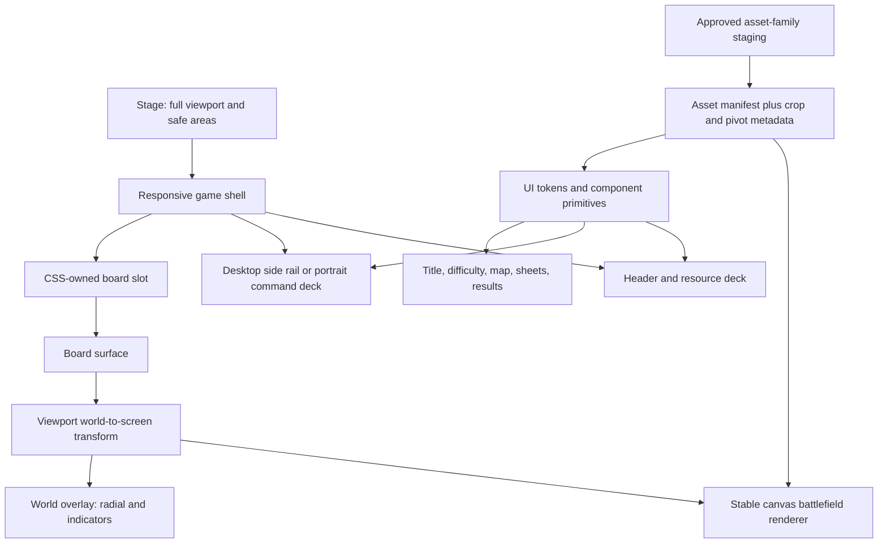
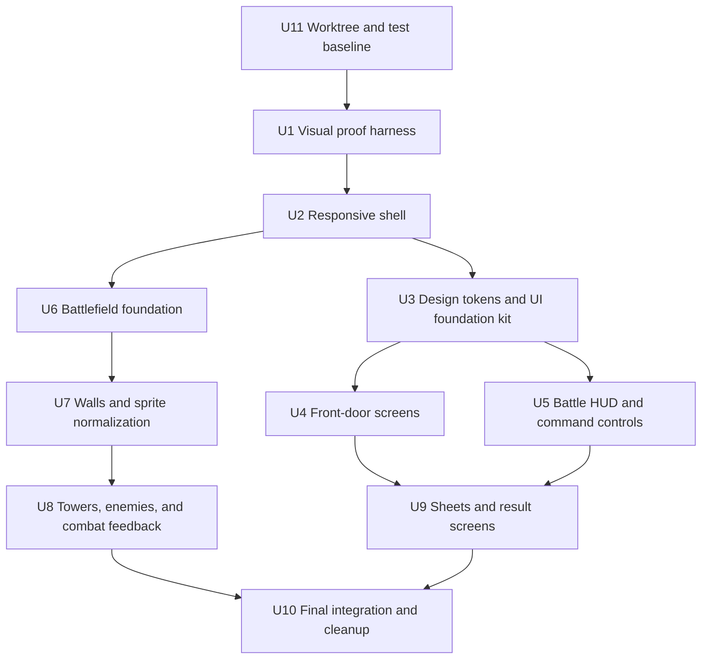

# Mazecore Premium Game Redesign - Plan

## Goal Capsule

- **Objective:** Redesign Mazecore TD into a cohesive, responsive, premium fantasy game whose level of finish evokes the team craft behind Clash Royale without copying its graphics, layouts, branding, or proprietary visual motifs.
- **Product identity:** “Crystal Kingdom Maze Defense” combines chunky toy-fantasy forms, bright anime-influenced characters, royal navy-and-gold chrome, red-brick maze walls, and crystal magic.
- **Authority:** User-approved screenshots and asset checkpoints override this plan; `docs/art/ART-BIBLE.md` and `docs/art/visual-direction.md` govern art; this plan governs implementation and verification.
- **Execution profile:** Work in checkpoint-sized vertical slices. Prove geometry and interaction before generating final art, approve each reusable asset family before wiring it broadly, and preserve the stable game simulation.
- **Stop conditions:** Pause when an asset family needs visual approval, when a layout choice would alter game rules, or when a proposed change cannot be shown as an improvement at the required browser sizes.
- **Tail ownership:** Implementation includes browser proof, regression checks, cleanup of superseded UI styles and rejected assets, and an updated art/asset contract.

---

## Product Contract

### Summary

Mazecore TD will gain one visual language across title, difficulty, campaign map, battle, overlays, and end states. The redesign prioritizes layout stability and battlefield readability first, then builds polish through reusable chrome, original iconography, approved asset families, purposeful motion, and consistent interaction states. The result should feel authored as a game rather than styled as a web page.

### Problem Frame

The current app has attractive individual illustrations but no reliable composition system joining them. At 1280x720, the title and difficulty panels are clipped to the right, the battle HUD overflows the narrow portrait board, and the first campaign destination is outside the initial map viewport. UI styling is split between inline CSS in `index.html` and a large `src/ui/ui.css`, uses emoji as production icons, and applies generic button transforms that have already caused selection controls to move when clicked.

Battle art has a second consistency problem. Many generated sprites are 1024x1024 images rendered into 32px cells without a formal crop, pivot, or safe-footprint contract. The battlefield background, walls, towers, route indicator, and frame therefore need in-context acceptance at game scale, not approval as isolated source images.

The target is inspiration at the level of craft: bold hierarchy, tactile controls, friendly competitive energy, clean silhouettes, rewarding transitions, and strong mobile legibility. Mazecore must retain its own crystal emblem, maze-building interaction, enemy-route language, anime influence, and red-brick wall identity.

### Requirements

**Visual identity and originality**

- R1. Every screen must use the Crystal Kingdom identity defined by a crystal crest, red-brick maze motif, royal navy, warm gold, cream, meadow green, cyan magic, and restrained danger red.
- R2. The redesign may borrow high-level qualities from premium fantasy battlers but must not reproduce Clash Royale logos, crowns, card frames, arena compositions, button silhouettes, character designs, fonts, or exact color arrangements.
- R3. Typography, icons, panels, buttons, badges, and motion must form one reusable game UI kit rather than screen-specific styling.
- R4. Emoji and operating-system glyphs must not remain as primary production icons where their rendering varies by platform.

**Responsive composition**

- R5. Title, difficulty, map, battle, sheets, and end screens must fit without clipping at 1280x720, 1440x900, 1024x1366, 430x932, 390x844, 844x390 coarse-pointer, and 932x430 coarse-pointer viewports.
- R6. The battle board must occupy a dedicated viewport slot while HUD and command controls occupy reserved screen space and never cover spawn gates, goal markers, wave labels, or readable board content.
- R7. Landscape layouts must use available side space instead of forcing the complete HUD into the width of a tall, narrow board.
- R8. Portrait and coarse-landscape layouts must preserve 44x44px touch targets, thumb-reachable controls, dynamic browser height, virtual-keyboard states, safe-area insets on every edge, and a readable board without page-level scrolling.
- R9. Campaign level selection must open with the current playable node visible and keep node geometry fixed through hover, press, focus, and selection states.

**Battlefield and combat readability**

- R10. The battlefield must use a flat top-down ground treatment with no perspective-conflicting trees, cliffs, or large flowers painted beneath build cells.
- R11. The enemy route must use the approved moving dashed line without a second path-tile layer; dash density must remain sparse enough that the ground stays dominant.
- R12. The board frame must read as one continuous fitted structure with clean corners and no repeated diagonal border tiles.
- R13. Red-brick walls must tile flush horizontally and vertically, show no level dot, preserve the 1x1 footprint, and align visually with adjacent tower bases.
- R14. Towers and enemies must have normalized pivots, padding, lighting, outlines, and game-scale silhouettes; upgrade levels must be distinguishable without changing their gameplay footprint.
- R15. Towers must render in a consistent depth order against walls, projectiles, health bars, and selection feedback without visible overlap errors.
- R16. Spawn and goal objects must be visually distinct, centered in their cells, and remain unobstructed by HUD chrome.

**Interaction and information design**

- R17. Hover, active, focus, selected, disabled, and locked states must not change an element's anchor, layout box, or click target.
- R18. Press feedback must come from internal highlight, shadow, color, or sub-element movement rather than translating the positioned control itself.
- R19. Empty-tile and tower radial menus must stay centered on their selected cell, including the center close button, at all board positions and camera states.
- R20. Tower statistics must appear only after the player chooses an explicit info action; ordinary tower hover shows no stats card.
- R21. The tower radial menu must place a clear info control beside upgrade while keeping build, upgrade, sell, target, and close actions visually distinct.
- R22. Resource, lives, wave, speed, pause, store, settings, build mode, and next-wave controls must communicate priority through shape and color without relying on text alone.
- R23. Store, settings, resume, info, victory, defeat, maze-results, and leaderboard surfaces must use the same panel and button primitives as the main flow.

**Motion, feedback, and accessibility**

- R24. Motion must emphasize state changes: screen entrance, button press, node unlock, build placement, tower attack, enemy hit, wave start, victory, and defeat.
- R25. Ambient or looping motion must not obscure the route, reduce tower readability, or create continuous visual noise.
- R26. Text and icon contrast, 44px touch targets, keyboard focus visibility, semantic button labels, and reduced-motion behavior must remain functional.
- R27. The redesign must preserve simulation determinism, difficulty balance, save compatibility, input behavior, and campaign progression.

**Approval and quality control**

- R28. Each asset family must pass concept-sheet approval, transparent export inspection, and in-context game-scale proof before replacing the currently wired family.
- R29. A checkpoint is complete only after the original issue is reproduced, the fix is observed, nearby interactions are regression-checked, and the new result is judged visually better.
- R30. Rejected, superseded, and temporary assets or styles must be removed before the redesign is declared complete.

### Key Flows

- F1. New campaign start
  - **Trigger:** The player presses Play on the title screen.
  - **Steps:** Title transitions to difficulty selection; difficulty is selected without panel movement; the campaign map opens centered on the current playable node; selecting that node opens the level.
  - **Outcome:** The route from launch to battle feels like one continuous product and the chosen difficulty remains visible where useful.
  - **Covered by:** R1-R9, R17-R18, R24, R27.

- F2. Resume or leave a pre-battle flow
  - **Trigger:** The player arrives through Continue, direct `?level=`, Hero Select, campaign Resume, Maze Mode, or Settings.
  - **Steps:** The current state is shown; Back, Home, Resume, Restart, or Close follows the navigation contract for that surface; stored difficulty and progress remain intact unless Restart explicitly replaces the run.
  - **Outcome:** Every pre-battle branch has a visible non-destructive exit and no screen becomes a navigation dead end.
  - **Covered by:** R5-R9, R17-R18, R23, R26-R27.

- F3. Build and inspect
  - **Trigger:** The player selects an empty board cell or an existing tower.
  - **Steps:** The radial menu opens centered on the cell; the player builds or chooses upgrade, info, target, or sell; the center close button dismisses without moving; stats appear only through info.
  - **Outcome:** Building remains fast and spatial while detailed information is deliberate and unobtrusive.
  - **Covered by:** R17-R23, R26-R27.

- F4. Read and start a wave
  - **Trigger:** The player surveys the prepared maze before a wave.
  - **Steps:** The HUD shows resources and wave state in reserved chrome; moving dashes identify the route; spawn and goal remain visible; Next Wave presents the primary action and reward.
  - **Outcome:** The player understands the board and can act without UI occlusion.
  - **Covered by:** R5-R16, R22, R25-R27.

- F5. Complete a campaign result
  - **Trigger:** A campaign or Endless run ends.
  - **Steps:** Victory presents earned stars and Next Level where applicable; defeat presents the existing revive opportunity; revive success returns to play; cancel or failure reaches replay, map, or home without changing progression rules.
  - **Outcome:** Campaign results preserve all current branches while using one clear reward hierarchy.
  - **Covered by:** R1-R4, R17-R18, R23-R27.

- F6. Complete a Maze Mode result
  - **Trigger:** A Maze Mode run ends.
  - **Steps:** The result shows the final time; the player enters a name; the virtual keyboard does not hide Save; successful save opens the leaderboard with the new row highlighted; cancel or failure keeps a usable exit.
  - **Outcome:** Maze results and leaderboard entry remain usable on desktop and mobile.
  - **Covered by:** R5-R8, R17-R18, R23-R27.

### Acceptance Examples

- AE1. Given a required viewport and fit-all camera, when level `l1` loads, then the complete HUD is readable, the board is centered within its slot, no control is clipped, and spawn and goal landmarks are visible and unobstructed.
- AE2. Given a zoomed or panned camera, when an existing spawn chevron's spawn leaves the visible board, then the chevron pins inside the board edge, points toward the spawn, avoids other chevrons and shell chrome, and returns to its world anchor when the spawn becomes visible; no new offscreen goal indicator is added.
- AE3. Given the campaign map with only level 1 unlocked, when the map opens, then First Steps is visible without manual scrolling and pressing it does not translate or resize the node.
- AE4. Given an empty build cell at any board corner and either fit or maximum zoom, when the radial opens and the center X is pressed, then the X center differs by no more than one CSS pixel, every enabled action remains onscreen and at least 44x44px, adjacent targets retain at least 8px separation, no action enters reserved HUD space, and the menu closes.
- AE5. Given adjacent walls in a 4x4 block and a one-cell corridor, when rendered at fit and maximum zoom, then horizontal and vertical joins have no transparent gaps, dots, diagonal seams, or tower-over-wall ordering errors.
- AE6. Given a tower under the pointer, when the player only hovers it, then no statistics card appears; when the player opens the tower radial and chooses Info, then the simplified card appears in a reserved non-occluding position.
- AE7. Given any coarse-pointer viewport, when enabled controls are measured, then every hit target is at least 44x44 CSS pixels, does not overlap another target, and matches the visible control bounds.
- AE8. Given Settings, Store, Info, radial, Resume, or a result surface is active, when the player uses Tab, then focus remains contained within the topmost surface; when the player uses Escape, browser/device Back, or an allowed backdrop action, then only that surface closes, focus returns to its invoker, and the prior pause state is restored.
- AE9. Given a coarse-landscape viewport, when the app loads and a full battle flow is exercised, then the rotate blocker does not replace gameplay and all primary controls remain usable.
- AE10. Given reduced motion is enabled, when screens and buttons change state, then information remains clear without looping bounce, pulse, or large transition movement.

### Success Criteria

- All seven required viewport sizes pass the screen-by-screen geometry matrix with no clipping, overlap, offscreen primary action, or state-induced movement.
- Full new-start, resume/restart, campaign-result/revive, and Maze-result/leaderboard flows can be completed using only visible, game-styled controls with no emoji-dependent meaning.
- In an approval playtest, the player can identify the primary action, explain the route direction, build and inspect a tower, and enter the first level without coaching or a critical navigation error.
- Towers, enemies, walls, background, frame, spawn, and goal pass game-scale contact-sheet review at 1x and 2.5x camera zoom.
- The full automated suite remains green and render determinism is unchanged.
- Every replaced asset family has an explicit approval checkpoint and no unapproved family is silently promoted from staging.

### Scope Boundaries

**Included**

- Title, difficulty, campaign map, battle HUD, radial controls, info surfaces, settings, store, resume, end screens, maze results, and leaderboard.
- Responsive layout architecture, visual tokens, icon system, battlefield frame/background, route rendering, live towers, walls, enemies, combat feedback, and asset validation.
- Heroes only where an existing hero surface must inherit the shared shell; new hero art is deferred.

**Deferred**

- New heroes, hero progression, new towers, new enemies, new maps, monetization changes, audio overhaul, and gameplay balance changes.
- Large cinematic sequences, 3D rendering, multiplayer presentation, or a framework migration.

**Outside the identity**

- Direct replicas of another game's logo, crown, card frame, arena, character, typography, icon, chest, or monetization treatment.
- Realistic medieval grime, thin ornamental filigree, neon cyberpunk styling, or dark-purple-as-default UI.

---

## Planning Contract

### Key Technical Decisions

- KTD1. **Layout precedes art.** Fix the responsive shell before final asset generation so approved graphics are judged in their real bounds and are not used to mask geometry defects.
- KTD2. **The board slot solely owns game geometry.** CSS grid owns `shell -> board-slot -> board-surface`; `board-surface` contains the stable canvas and world overlay, while `Viewport` only measures that slot and sizes the surface. Shell overlays never participate in world-viewport measurement.
- KTD3. **One layered component kit owns chrome.** Use native CSS layers for tokens, primitives, shell layout, battle UI, screen compositions, and utilities under `src/ui/styles/`, with `src/ui/ui.css` as the ordered entry point. Remove competing global button/card rules from `index.html`; selectors stay class-based and low-specificity.
- KTD4. **CSS and nine-slice chrome serve different jobs.** Use CSS for responsive structure and state; use approved scalable frame/corner artwork only where it adds authored texture without baking text or fixed dimensions into images.
- KTD5. **Production icons are local assets with text alternatives.** Replace emoji with an original coherent icon atlas or individual SVG/PNG files while preserving accessible labels in DOM controls.
- KTD6. **Sprite metadata is a versioned rendering contract.** Extend the manifest with asset kind, logical size, pivot or ground anchor, trim/source rectangle, frame layout, coordinate space, scale mode, family, and nine-slice insets where applicable. Keep current string and sheet entries backward compatible while families migrate.
- KTD7. **Walls use a deterministic connected red-brick atlas.** Render a compact adjacency-mask atlas with isolated, edge, straight, corner, T, cross, and center treatments. The renderer chooses the tile by neighbors; procedural edge-aware drawing remains only a dimensionally identical fallback.
- KTD8. **Interaction anchors never animate.** Positioned controls keep a constant transform; press/selection motion is applied to an inner visual layer or shadow so click geometry cannot drift.
- KTD9. **Art approval uses three views.** Each family is reviewed as a source/contact sheet, a transparent-background export check, and a live 32px/required-viewport screenshot before manifest promotion.
- KTD10. **No gameplay rewrite.** Rendering and UI consume existing state/actions; balance, pathfinding, saves, simulation timing, and progression remain untouched unless a regression fix is required to preserve current behavior.
- KTD11. **Input is gated at the shell boundary.** Preserve the stable canvas node and default-deny `pointer-events` overlay pattern, route client-to-world conversion through `Viewport`, and disable gameplay input while modal or shell interactions own the pointer or keyboard.
- KTD12. **Structural viewport changes are interaction transaction boundaries.** Orientation, breakpoint/shell-mode, or board-slot changes cancel active gestures, close stale world-anchored controls, recompute transforms, and then re-enable input. Transient visual-viewport changes from browser chrome or keyboard animation are stabilized, preserve valid interactions, and update shell insets without repeatedly resetting the camera.
- KTD13. **The radial center never moves.** The center close control remains fixed on the projected cell. Peripheral actions rotate and fan into available board space in stable slot order; when 44px targets with 8px separation cannot fit, peripheral actions move into the reserved command deck while the center control remains cell-anchored.
- KTD14. **Navigation uses one browser-history-backed surface stack.** Full screens push or replace history deliberately; overlays push a top-surface state; `popstate` closes only the top eligible surface and restores focus/pause. Direct `?level=` entry has no invented prior page, so browser Back may leave the app while visible Home/Map actions remain available. Native-wrapper hardware Back is out of scope.

### High-Level Technical Design

The shell has three responsive modes. Wide landscape uses a centered playfield composition with the board between compact information/action rails. Tall portrait uses a full-width top resource deck, the board slot, and a bottom command deck. Compact phone portrait reduces labels and secondary controls but preserves the same hierarchy and 44px touch targets. Breakpoints are selected from measured fit constraints rather than device names.

The CSS entry point declares ordered `tokens`, `primitives`, `layout`, `battle`, `screens`, and `utilities` layers. Screen selectors do not style bare `button` or generic `.card` elements, and component states use one-class modifiers rather than escalating specificity. U3 records breakpoint values and layer ownership after fit tests; any repeated cross-layer override is treated as a component-boundary defect rather than patched with higher specificity.

The board remains a canvas with stable world coordinates. `Viewport.resize()` reads the board-slot rectangle, updates the board surface and world overlay, and keeps fit/pan/zoom behavior. Shell assets never determine geometry from decoded image dimensions; critical shell art loads before gameplay input or uses a dimensionally identical fallback. World sprites may continue loading progressively because they cannot affect transforms or hit targets.

Coordinate spaces remain explicit throughout implementation:

| Space | Content | Mount and clipping owner | Transform and pointer policy |
|---|---|---|---|
| World | Canvas entities, cell selection, radial ring, spawn chevrons | `board-surface`; clipped to or deliberately pinned against the board slot | World-to-board transform; gameplay pointer gate applies |
| Board | Board-fixed callouts that belong to the visible battlefield | `board-surface` overlay | Board CSS coordinates; never changes world transform |
| Screen/shell | Resources, utilities, command deck, banners, sheets, navigation, modals | Responsive shell or modal layer | Screen CSS coordinates and safe areas; controls opt into pointer events |

### Asset Production and Approval Pipeline

1. Produce a family brief and contact sheet using `docs/art/reference/art-guide.png`, the approved Crystal Kingdom palette, and the closest live sibling.
2. Review silhouette, lighting, originality, footprint, and family consistency before exporting individual files.
3. Normalize transparent padding, pivots, and dimensions; keep generated originals in staging until approved.
4. Render an in-game proof at actual sizes against the approved background and neighboring assets.
5. Promote only approved files into `assets/`, update `assets/manifest.json`, and run asset contract tests.
6. Remove rejected variants and record durable family rules in `docs/art/ART-BIBLE.md`.

Asset-family order:

1. UI foundation kit: panel corners/edges, button surfaces, badges, resource wells, and icon style.
2. Battlefield foundation: flat dirt/grass ground, continuous frame, sparse route treatment, spawn, and crystal/castle goal.
3. Wall family: red-brick connected pieces and build/selection feedback.
4. Tower family: base and five upgrade silhouettes plus attack cycles, normalized together.
5. Enemy family: role silhouettes and movement cycles, normalized together.
6. Screen identity: title crest/logo lockup and campaign-map decoration.
7. Modal/reward ornaments and combat VFX accents.

### Sequencing

U3, U6, U7, and U8 contain user-facing asset approval gates. Work may prepare later candidates in `assets/staging/`, but no later unit may wire an unapproved family into production.

U4, U5, and U9 also end at blocking screen-composition approvals. Their evidence bundle contains the required viewport screenshots, measured geometry results, interaction-state proof, and a short human rubric covering originality, cohesion, hierarchy, readability, and game feel. A rejection loops within the same unit; dependent units do not begin until the revised composition is approved.

Delivery has two releasable milestones. Milestone A contains U11-U5 and ships responsive geometry, stable interaction/navigation, accessibility, and the functional icon/chrome foundation without waiting for the complete battlefield roster. Milestone B contains U6-U10 and promotes approved battlefield, wall, tower, enemy, motion, and secondary-screen art families into one final cohesive release.

### Navigation and Modal Contract

| Surface | Entry | Primary continuation | Non-destructive exit | Persistence rule |
|---|---|---|---|---|
| Title | App root or Home | Play, Continue, Maze Mode | Settings returns to Title | Never clears difficulty or save implicitly |
| Difficulty | Play | Selected mode continues to Hero Select when enabled, otherwise Map | Back returns to Title | Selection persists only after explicit choice |
| Hero Select | New campaign when heroes are enabled | Hero choice continues to Map | Back returns to Difficulty | Back does not assign a hero |
| Campaign Map | New/continued campaign | Current unlocked level or Endless | Home returns to Title | Current-node scroll and difficulty persist |
| Resume Prompt | Entering a level with a snapshot | Resume or Restart | Back returns to Map | Restart is the only destructive choice |
| Direct `?level=` | External/local deep link | Level or Resume Prompt | Home/Map follows mode availability | Query difficulty overrides stored mode for that entry |
| Maze Mode | Title | Start run | Home returns to Title | Does not alter campaign snapshot |
| Settings/Store/Info | Invoking screen | Apply action or Close | Escape/Back closes topmost surface | Restores invoker focus and prior pause state |
| Campaign Result | Win, loss, Endless end | Next Level, revive, replay, or map as currently available | Home returns to Title | Existing star/save/revive effects remain authoritative |
| Maze Result | Maze end | Save name and show leaderboard | Home returns to Title | Failed/cancelled save keeps a usable result screen |

Only the topmost modal surface handles Escape or browser/device Back. Modal opening records the invoker and prior pause state, moves focus to the first meaningful action, contains focus while active, then restores focus and pause state on close. Backdrop dismissal is enabled only for non-destructive informational surfaces.

### Secondary Surface State and Content Contract

| Surface | Content order | Fallible states and recovery |
|---|---|---|
| Settings | Title, grouped controls, help, Close | Changes apply immediately; unavailable options explain why; Close always remains visible |
| Store | Currency/status, available items, selected item detail, purchase action, Close | Idle, unavailable, insufficient funds, pending, success, recoverable failure; pending disables duplicate purchase |
| Rewarded ad / revive | Consequence, reward, primary watch/revive action, decline | Ready, loading, user-cancelled, unavailable, success, recoverable failure, terminal failure; every non-success state exposes a safe result exit |
| Resume | Level/wave context, Resume primary, Restart destructive, Back | Missing/stale snapshot falls back to fresh entry without trapping the player; Restart requires explicit action |
| Campaign victory | Outcome, stars/rewards, progression summary, Next Level primary, Map/Home secondary | Reward application is idempotent and actions enable only after the result state is ready |
| Campaign defeat / Endless | Outcome, run summary, revive when eligible, Replay primary, Map/Home secondary | Revive pending prevents duplicate action; cancel/failure returns to stable defeat choices |
| Maze score entry | Final time, name field, Save primary, Home secondary | Empty/invalid name, pending, duplicate prevention, success, recoverable save failure; keyboard never hides Save |
| Leaderboard | Player result context, ranked list, highlighted saved row, Replay/Home | Loading, empty, success, recoverable failure; failure retains the local result and retry/exit actions |

### Risks and Mitigations

| Risk | Mitigation |
|---|---|
| A polished shell reduces usable board area | Establish viewport budgets first and require board/readability proofs at all target sizes before styling detail. |
| Generated art looks good alone but fails at 32px | Require contact sheets and live 1x/2.5x proofs; normalize crop/pivot metadata before promotion. |
| Visual inspiration becomes imitation | Use the Crystal Kingdom identity and document forbidden direct motifs; review similarity at the family concept stage. |
| CSS state changes reintroduce button movement | Make constant-anchor geometry a tested component invariant and animate inner layers only. |
| Large image sets increase memory or load time | Keep runtime exports dimensioned for use, preload by family, cap DPR, and preserve procedural fallbacks where they remain visually acceptable. |
| UI refactor breaks gameplay input | Keep canvas/world transforms stable, characterize current input flows, and verify tap, drag-build, pan, pinch, wheel, and radial actions after each shell change. |
| Dirty working tree mixes prior experiments with redesign | Preserve user changes, promote only approved assets, and remove only files proven to be superseded by this plan's work. |

---

## Implementation Units

| Unit | Title | Key files | Depends on |
|---|---|---|---|
| U11 | Worktree and test baseline | `docs/art/redesign-baseline.md`, `test/run.mjs` | None |
| U1 | Visual baseline and proof harness | `test/t15ui-contract.mjs`, `test/ui-harness.html` | U11 |
| U2 | Responsive game shell | `index.html`, `src/main.js`, `src/ui/viewport.js`, `src/engine/input.js` | U1 |
| U3 | UI foundation and asset metadata | `src/ui/ui.css`, `src/ui/components.js`, `src/ui/sprites.js`, `assets/ui/` | U2 |
| U4 | Title, difficulty, and campaign map | `src/ui/screens.js`, `assets/misc/` | U3 |
| U5 | Battle HUD and information hierarchy | `src/ui/hud.js`, `src/ui/radial.js`, `src/ui/infocard.js` | U3 |
| U6 | Battlefield foundation | `src/ui/render.js`, `assets/misc/background.png`, `assets/tiles/` | U2, U3 |
| U7 | Connected walls and sprite diagnostics | `src/ui/render.js`, `assets/tiles/wall-*.png`, `test/t16sprite-layout.mjs` | U3, U6 |
| U8 | Towers, enemies, and combat feedback | `assets/towers/`, `assets/enemies/`, `assets/sheets/` | U7 |
| U9 | Secondary sheets and results | `src/ui/screens.js`, `src/ui/sheets.js` | U4, U5 |
| U10 | Integration and cleanup | `src/ui/`, `assets/`, `docs/art/` | U4-U9 |

### U11. Establish worktree ownership and a trustworthy test baseline

- **Goal:** Prevent pre-existing gameplay, asset, and test changes from being overwritten or misattributed to the redesign.
- **Requirements:** R27-R30.
- **Files:** `docs/art/redesign-baseline.md`, `test/run.mjs`, existing modified and untracked files as inventory inputs only.
- **Approach:** Use `feat/maze-mode` at commit `265ce0a`, plus its current retained worktree changes, as the authoritative baseline; do not execute this plan from `master`. Record every current modified/untracked path as retained prior work, redesign-owned work, generated candidate, or disposable runtime artifact before cleanup begins. Capture current visual states and test outcomes. The current review reports failures in `t10validate.mjs` and all three campaign simulation gates; determine whether each is a stale expectation against already-approved balance or an actual behavior defect. Rebaseline tests only when current behavior is already authoritative; do not change balance to make the redesign baseline green. Preserve a recoverable pre-redesign diff and prohibit deletion of unowned files.
- **Test scenarios:**
  - Every dirty path has an owner/category and no later unit deletes or rewrites an unclassified path.
  - Full-suite failures are reproduced and attributed before UI work starts.
  - Approved current gameplay reaches a green baseline through test correction only; any behavior defect that requires gameplay change is surfaced as a blocker.
  - Baseline screenshots and asset inventory identify which current candidates are production, staging, or rejected.
- **Verification:** The baseline document contains the worktree inventory, known test state, visual evidence index, and cleanup ownership rules; `npm test` is green or execution pauses on a genuine non-visual blocker.

### U1. Establish the visual baseline and proof harness

- **Goal:** Make every redesign claim reproducible with deterministic screen states, viewport sizes, and comparison evidence.
- **Requirements:** R28-R30.
- **Files:** `docs/art/ART-BIBLE.md`, `docs/art/UI-REDESIGN-CHECKLIST.md`, `test/t15ui-contract.mjs` (create), `test/ui-harness.html` (create), `test/run.mjs`.
- **Approach:** Add a lightweight local visual-state harness for title, difficulty, map, battle-empty, radial-empty, radial-tower, info, settings, victory, and defeat. Record the required viewport matrix, component invariants, and screenshot naming convention. Update the art bible with the Crystal Kingdom identity, originality guardrails, and three-view approval rule.
- **Test scenarios:**
  - The harness can open every named state without changing saved progression or balance.
  - Each state exposes stable selectors or labels for browser verification.
  - The UI contract test fails if required screens, state classes, coordinate-space mount points, or accessibility labels disappear, and it is registered in `test/run.mjs`.
  - Baseline screenshots capture the known 1280x720 title, difficulty, map, and battle clipping issues.
- **Verification:** Run `node test/t15ui-contract.mjs`, then capture the full baseline matrix before U2 changes layout.

### U2. Replace board-derived positioning with a responsive game shell

- **Goal:** Give the board and UI dedicated, centered regions that fit every required viewport without clipping or occlusion.
- **Requirements:** R5-R9, R16-R19, R26-R27.
- **Files:** `index.html`, `src/main.js`, `src/engine/input.js`, `src/ui/ui.css`, `src/ui/viewport.js`, `src/ui/hud.js`, `src/ui/topbar.js`, `src/ui/wavebar.js`, `src/ui/herobar.js`, `src/ui/radial.js`, `test/t10viewport.mjs`, `test/t15ui-contract.mjs`.
- **Approach:** First preserve one stable canvas node, retain the current `Viewport.clientToWorld` interface as the only conversion path, and add a gameplay-input gate for shell and modal ownership. Then introduce semantic shell regions for resource deck, board slot, contextual rail, and command deck; `src/main.js` wires the board-slot element into `Viewport`. CSS owns the board slot; `Viewport` measures it and sizes only the board surface. World controls use the world overlay, board-fixed callouts use board coordinates, and shell controls use their own regions. Define wide-landscape, tall-portrait, and compact-phone compositions using shared DOM and CSS, removing the coarse-landscape rotate blocker after the layout passes.
- **Test scenarios:**
  - 1280x720 uses side space and shows the complete HUD, board, Next Wave, settings, store, and speed controls.
  - 1440x900 scales without leaving the board or title panel stranded off-center.
  - 1024x1366, 430x932, and 390x844 use portrait composition with safe-area padding and no horizontal overflow.
  - World-to-UI mapping, tap coordinates, drag-build, pan, pinch, wheel zoom, and edge chevrons remain correct.
  - Pressing shell controls never produces a build; releasing a board drag over chrome does not synthesize a click; open sheets suppress gameplay shortcuts.
  - Orientation or shell-mode change during a drag, targeting state, or open radial cancels stale input and restores a correct transform.
  - URL-bar collapse, keyboard animation, and repeated visual-viewport events preserve valid input/radial state and settle without camera reset or layout oscillation.
  - Hiding and restoring the board slot cannot collapse or permanently shrink the canvas.
  - Spawn and goal cells are not covered by shell controls.
- **Verification:** Run `node test/t10viewport.mjs` and `node test/t15ui-contract.mjs`; complete the seven-size geometry matrix for battle and all modal screens before U3.

### U3. Build the Crystal Kingdom UI foundation kit

- **Goal:** Replace mixed web styling with one original, tactile, reusable game UI system.
- **Requirements:** R1-R4, R17-R18, R22, R24-R26, R28.
- **Files:** `index.html`, `src/ui/ui.css`, `src/ui/styles/` (create), `src/ui/components.js`, `src/ui/sprites.js`, `assets/ui/` (create), `assets/manifest.json`, `tools/gen-assets.mjs`, `test/t13assets.mjs`, `test/t14asset-files.mjs`, `test/t15ui-contract.mjs`, `test/t16sprite-layout.mjs` (create), `test/run.mjs`.
- **Approach:** Define layered token groups for color, typography, spacing, elevation, bevel, focus, and motion. Create reusable panel, button, icon-button, resource-chip, badge, tab, card, divider, and progress primitives. Introduce and validate the versioned asset metadata contract before premium art is wired, preserving backward compatibility for current manifest entries. Replace OS emoji with an approved icon family and remove equivalent global button/card declarations from `index.html`. Use an inner `.control-face` or pseudo-element for tactile press feedback while the outer control remains fixed.
- **Test scenarios:**
  - Primary, secondary, danger, build, info, upgrade, sell, locked, disabled, selected, hover, focus, and pressed states remain centered and retain identical outer bounds.
  - Icons remain readable at 18, 24, and 32px and include accessible names in controls.
  - Legacy string and `{src, frames, grid}` sheet entries load unchanged while metadata-backed UI assets resolve their declared kind, size, scale mode, and nine-slice insets.
  - Generator output and checked-in `assets/manifest.json` agree; schema validation covers all referenced UI, tower, enemy, sheet, tile, and miscellaneous paths.
  - Late or missing visual assets use dimensionally identical fallbacks and never change shell or board geometry.
  - `test/t16sprite-layout.mjs` is registered in `test/run.mjs` before dependent art units begin.
  - Text meets contrast targets on navy, cream, gold, green, and red surfaces.
  - Reduced-motion mode removes decorative loops while preserving state recognition.
  - Layer ordering is deterministic, no screen depends on bare-element button/card styling, and component state rules do not increase selector specificity.
- **Verification:** Obtain approval for the UI foundation contact sheet and in-browser component gallery; run asset and UI contract suites before production screens adopt the kit.

### U4. Redesign title, difficulty, and campaign map as one front-door flow

- **Goal:** Make the first three screens feel celebratory, centered, readable, and visually continuous.
- **Requirements:** R1-R9, R17-R18, R23-R26.
- **Files:** `src/ui/screens.js`, `src/ui/ui.css`, `assets/misc/title.png`, `assets/misc/icon.png`, `assets/misc/worldmap.png`, `assets/manifest.json`, `test/t15ui-contract.mjs`.
- **Approach:** Build a balanced title lockup with original crystal crest, readable Mazecore wordmark, a clear primary Play action, and quieter secondary actions. Present difficulty as three concise game cards with distinct challenge cues and persistent selection. Recompose the campaign map header, route, nodes, locks, stars, and difficulty indicator; calculate initial scroll so the current playable node is visible. Keep node anchors fixed and apply selection emphasis inside the badge. Assign restrained screen entrance and node-unlock motion here, with reduced-motion equivalents that preserve hierarchy without translation.
- **Test scenarios:**
  - Title and difficulty panels are fully visible and centered at every required viewport.
  - Play, Back, Normal, Easy, and Expert operate without control movement or lost selection.
  - The campaign map opens on the current playable node and level selection navigates with the correct difficulty query.
  - Locked, available, current, completed, and endless nodes are distinguishable without positional changes.
  - Long labels and zero-star/new-profile states do not clip.
  - Screen entrance and node unlock are observable in normal motion and remain understandable with reduced motion.
- **Verification:** Browser-check F1 and F2 at all required sizes and compare title, difficulty, and map together before approval.

  Approval evidence includes the seven-size screenshots, current-node scroll measurement, stable node/control bounds, and the human visual rubric. U9 cannot finalize result/navigation surfaces until this composition is approved.

### U5. Rebuild the battle HUD, radial controls, and information hierarchy

- **Goal:** Frame the board with high-priority game controls while preserving clear board space and stable spatial interactions.
- **Requirements:** R5-R9, R16-R23, R25-R27.
- **Files:** `src/ui/hud.js`, `src/ui/topbar.js`, `src/ui/wavebar.js`, `src/ui/radial.js`, `src/ui/infocard.js`, `src/ui/multiselect.js`, `src/ui/hints.js`, `src/ui/ui.css`, `test/t10viewport.mjs`, `test/t12mechanics.mjs`, `test/t15ui-contract.mjs`.
- **Approach:** Group gold/lives/wave as readable resources, separate utility controls, and give Next Wave the dominant action treatment. Keep the radial center fixed on the selected cell; rotate/fan peripheral actions inward in stable slot order, falling back to the reserved command deck when spacing cannot be preserved. Use approved icons with explicit info beside upgrade. Remove tower-stat hover behavior while retaining deliberate enemy/touch inspection as specified. Dock the simplified info card in a shell region that cannot cover the ring or gates. Restyle drag-build, multi-select, warnings, and tutorial hints through the same primitives. Assign button-press and build-placement motion here with reduced-motion feedback.
- **Test scenarios:**
  - Empty-cell X and every ring item remain fixed through mouse down, active, focus, click, disabled, and close.
  - Tower hover does not open stats; Info opens the correct card; dismiss and auto-dismiss do not alter selection unexpectedly.
  - Radials near all four corners clamp without overlapping reserved HUD regions.
  - Next Wave, speed, pause, store, settings, drag-build, multi-select, upgrade, target, sell, and info retain existing behavior.
  - No HUD element overlaps spawn/goal markers or readable wave callouts.
  - Normal and reduced-motion modes both communicate button press and successful/failed build placement without moving control anchors.
- **Verification:** Run viewport and mechanics suites; perform F3 and F4 with pointer and touch-sized viewports before U6 integration.

  Approval evidence includes empty-cell and tower-radial pressed-state overlays, HUD landmark clearance, coarse-pointer target measurements, and the human visual rubric. U9 cannot adopt the command/modal treatment until this composition is approved.

### U6. Rebuild the battlefield foundation and continuous frame

- **Goal:** Create a flat, coherent board surface that supports gameplay instead of competing with it.
- **Requirements:** R10-R12, R16, R25-R29.
- **Files:** `src/ui/render.js`, `src/ui/sprites.js`, `assets/misc/background.png`, `assets/tiles/`, `assets/misc/spawn.png`, `assets/misc/camp.png`, `assets/manifest.json`, `tools/gen-assets.mjs`, `test/t12render.mjs`, `test/t13assets.mjs`, `test/t14asset-files.mjs`.
- **Approach:** Approve a flat top-down dirt/grass foundation with low-frequency texture and no perspective scenery beneath cells. Replace repeated border pieces with one continuous frame treatment that has explicit edge and corner behavior. Remove path-tile rendering from the live route and retain sparse moving dashes with contrast tuned against the ground. Normalize and center spawn and crystal/castle goal markers.
- **Test scenarios:**
  - Background cover/crop does not stretch or introduce perspective conflicts on the shortest and tallest levels.
  - Frame edges and corners meet with no gaps at DPR 1, 1.5, and 2.
  - The route contains moving dashes and no path tile; its dash count remains approximately half the earlier dense treatment.
  - Spawn and goal remain centered and distinct at fit and 2.5x zoom.
  - Static-layer caching and render determinism remain unchanged.
  - Checked-in manifest entries, generator declarations, metadata schema, and every promoted battlefield path agree.
- **Verification:** Approve the battlefield foundation family in empty-board and active-wave screenshots, then run render and asset suites.

### U7. Implement connected red-brick walls and sprite normalization

- **Goal:** Make maze construction tile cleanly and establish a reusable sprite alignment contract.
- **Requirements:** R13-R15, R17, R27-R30.
- **Files:** `src/ui/render.js`, `src/ui/sprites.js`, `assets/towers/wall.png`, `assets/towers/wall-stackable.png`, `assets/tiles/wall-*.png`, `assets/manifest.json`, `tools/gen-assets.mjs`, `test/t12render.mjs`, `test/t13assets.mjs`, `test/t14asset-files.mjs`, `test/t16sprite-layout.mjs`.
- **Approach:** Produce an approved red-brick adjacency atlas with isolated, straight, corner, T, cross, edge, and center behavior. The renderer selects atlas cells from deterministic neighbor masks; a dimensionally identical procedural treatment is the missing-asset fallback only. Remove wall level dots by contract. Apply the U3 metadata contract and create diagnostics that render logical bounds and contact sheets at game scale. Use a shared depth policy for wall, tower base, tower body, selection, HP, and effects.
- **Test scenarios:**
  - Horizontal line, vertical line, corners, T-junction, cross, 1-cell corridor, and 4x4 block tile flush without seams.
  - Isolated walls remain readable and no wall shows a level dot.
  - Towers beside and between walls do not sink behind, float above, or clip through wall faces.
  - Manifest metadata produces stable pivots with and without sprite fallbacks.
- **Verification:** Obtain approval on the wall topology contact sheet and live maze proof; run render, asset, and sprite-layout suites.

### U8. Normalize towers, enemies, upgrade silhouettes, and combat feedback

- **Goal:** Make the live combat roster read as one anime toy-fantasy family at actual play size.
- **Requirements:** R14-R16, R24-R29.
- **Files:** `assets/towers/`, `assets/enemies/`, `assets/sheets/`, `src/ui/render.js`, `src/ui/sprites.js`, `assets/manifest.json`, `tools/gen-assets.mjs`, `test/t12render.mjs`, `test/t13assets.mjs`, `test/t14asset-files.mjs`, `test/t16sprite-layout.mjs`.
- **Approach:** Audit rather than blindly replace. Normalize every live tower and enemy against family templates, then regenerate only assets that fail silhouette, crop, pivot, lighting, or role-read tests. Strengthen upgrade progression through controlled attachments, material, glow, and silhouette milestones while preserving the 1x1 footprint. Align attack/movement frames and refine tower-attack, enemy-hit, impact, status, and wave-start effects without covering route decisions.
- **Test scenarios:**
  - Each tower role and enemy role is identifiable in a no-label contact sheet at 32px.
  - Tower levels 1-5 are ordered visually and adjacent levels are distinguishable, especially cannon upgrades.
  - Attack and movement frames have stable feet/base pivots and no scale pumping.
  - Enemy stacks, bosses, flyers, shields, poison, frost, and projectile impacts remain readable over walls and dashes.
  - Fallback chains still work when a level sprite or sheet is unavailable.
  - Tower attack, enemy hit, and wave start each have a readable normal-motion cue and a reduced-motion cue with equivalent state information.
- **Verification:** Approve towers and enemies as separate family checkpoints; run asset, sprite, and render suites after each promotion.

### U9. Apply the system to sheets, settings, store, resume, and result screens

- **Goal:** Eliminate remaining generic modal/web UI and make secondary surfaces feel native to the same game.
- **Requirements:** R1-R4, R17-R18, R23-R27.
- **Files:** `src/main.js`, `src/ui/components.js`, `src/ui/screens.js`, `src/ui/sheets.js`, `src/ui/ui.css`, `src/services/ads.js`, `test/t10ads.mjs`, `test/t12resume.mjs`, `test/t15ui-contract.mjs`.
- **Approach:** Implement the browser-history-backed surface stack and one modal lifecycle shared by sheets and screens: top-layer Escape/Back handling, dialog semantics, initial focus, focus containment, invoker restoration, and pause-state restoration. Recompose settings and store according to the secondary content/state contract with compact rows, approved icons, pending/disabled feedback, duplicate-action prevention, and recoverable exits. Redesign resume, campaign victory/defeat/revive, Endless results, Maze name/save/results, and leaderboard as distinct reward/result flows using the shared shell. Assign victory/defeat entrance and reward motion here with reduced-motion equivalents. Keep ads visually subordinate and preserve their existing behavior.
- **Test scenarios:**
  - Every sheet fits required viewports, scrolls internally when needed, and keeps close/primary actions visible.
  - Settings toggles, store purchases, rewarded-ad flow, resume/restart, replay/map/home, maze score save, and leaderboard highlight still work.
  - Victory and defeat are visually distinct without changing action order or progression effects.
  - Focus return, Escape/back, and backdrop dismissal behave consistently.
  - Store, ad, revive, Maze save, and leaderboard states cover idle, pending, success, unavailable/cancelled, recoverable failure, terminal failure, and duplicate-action prevention where applicable.
  - Victory and defeat motion communicates outcome in normal and reduced-motion modes without delaying the primary action.
- **Verification:** Run ads, resume, and UI contract suites; complete F5, F6, and the secondary-surface viewport matrix.

  Approval evidence includes every result branch, keyboard-open Maze save, modal focus/Back proof, all required viewport screenshots, and the human visual rubric. U10 does not begin until this surface family is approved.

### U10. Integrate, optimize, and remove visual debt

- **Goal:** Ship one coherent system with no dead styles, unapproved assets, layout regressions, or gameplay changes.
- **Requirements:** R1-R30.
- **Files:** `index.html`, `src/ui/`, `src/ui/ui.css`, `assets/`, `assets/manifest.json`, `tools/gen-assets.mjs`, `docs/art/ART-BIBLE.md`, `docs/art/ART-PIPELINE-BRIEF.md`, `test/run.mjs`.
- **Approach:** Audit all routes and runtime states, remove superseded inline CSS and rejected/staging references, right-size runtime images, verify fallback behavior, and update durable art/asset documentation. Compare final screenshots to the baseline and evaluate each change against clarity, cohesion, originality, and game feel.
- **Test scenarios:**
  - Full new-game, continue, campaign map, campaign battle, maze mode, settings, store, win, loss, and leaderboard flows complete without console errors.
  - All required viewport/state combinations pass geometry and interaction checks.
  - No production control uses an unapproved emoji/icon or a state transform that moves its anchor.
  - Asset manifest contains no missing files and production code does not reference rejected staging files.
  - Save, progression, difficulty, balance, deterministic render, and campaign simulation tests remain green.
- **Verification:** Run `npm test`, inspect browser console logs, complete the final screenshot matrix, and perform a side-by-side baseline review before declaring completion.

---

## Verification Contract

### Automated Gates

| Gate | Command | Proves | Units |
|---|---|---|---|
| UI structure | `node test/t15ui-contract.mjs` | Required screens, primitives, stable-state hooks, labels, and no forbidden production-icon regressions | U1-U5, U9-U10 |
| Viewport and input | `node test/t10viewport.mjs` | Board-slot transforms, fit, pan, zoom, gestures, and safe anchor mapping | U2, U5, U10 |
| Gameplay mechanics | `node test/t12mechanics.mjs` | Build and tower actions retain current behavior | U5, U10 |
| Render contract | `node test/t12render.mjs` | Sprite fallback, static cache, view culling, and deterministic rendering | U6-U8, U10 |
| Asset manifest | `node test/t13assets.mjs` | Generator output matches the checked-in manifest and every asset family satisfies the versioned metadata schema | U3, U6-U8, U10 |
| Asset files | `node test/t14asset-files.mjs` | Every promoted UI, tower, enemy, sheet, tile, and miscellaneous runtime path exists | U3, U6-U8, U10 |
| Sprite layout | `node test/t16sprite-layout.mjs` | Logical bounds, pivots, frame consistency, and wall topology are valid | U7-U8, U10 |
| Save/resume and ads | `node test/t12resume.mjs` and `node test/t10ads.mjs` | Secondary UI refactors preserve run and rewarded-action behavior | U9-U10 |
| Full regression | `npm test` | Simulation, balance, progression, saves, input, rendering, and assets remain green | U10 |

### Browser Geometry Matrix

Run each checkpoint at 1280x720, 1440x900, 1024x1366, 430x932, 390x844, 844x390 coarse-pointer, and 932x430 coarse-pointer. Repeat mobile states with representative non-zero safe-area insets, a reduced dynamic viewport height, orientation changes, and the virtual keyboard open on the Maze name field. Verify title, difficulty, map, battle-empty, empty-cell radial, tower radial pressed/selected, info card, settings, store, resume, campaign victory/defeat/revive, Endless result, Maze result/save, leaderboard, and modal navigation. For each state record:

- No horizontal or vertical clipping of primary content.
- No control overlap with another control or reserved board landmark.
- Primary action visible without accidental page scrolling.
- Stable bounding box through hover, focus, active, selected, and disabled states.
- Text and icons legible at normal browser zoom.
- No unexpected console errors or missing asset requests.
- Every coarse-pointer target is at least 44x44px with at least 8px separation where radial actions cluster.
- Escape/Back, focus return, pause restoration, and virtual-keyboard layout match the navigation/modal contract.

After U2 records the actual fit-derived breakpoints, sweep each breakpoint at -1px, the boundary, and +1px in both relevant dimensions. Repeat representative states at 125% browser zoom and 200% text scaling. The same clipping, overlap, board-visibility, and touch-target invariants apply between named device checkpoints.

### Issue-to-Proof Matrix

| Baseline issue | Reproduction evidence | Pass threshold | Owner |
|---|---|---|---|
| Title/difficulty clipped right at 1280x720 | Baseline screenshot plus panel bounding rectangle | Full panel and primary/secondary actions inside viewport; horizontal center delta at most 1px | Automated geometry plus human composition approval |
| Battle HUD overflows narrow portrait board in landscape | `l1` screenshot and control rectangles | All controls inside shell, no overlap, no spawn/goal occlusion | Automated geometry |
| Campaign opens away from playable node | New-profile map screenshot and scroll position | Current playable node intersects initial visible map region | Automated state check |
| Stage/radial controls move when active | Before/down/after bounding rectangles | Outer center and dimensions differ by at most 1px | Automated interaction check |
| Ground, border, walls, towers, and route do not read as one board | Fixed DPR screenshots at fit and 2.5x | Numeric seam/occlusion checks pass and approved visual rubric scores pass | Automated render checks plus human asset approval |
| Secondary screens resemble generic web modals | Settings/store/result comparison bundle | Shared primitives, hierarchy, focus, and navigation gates pass; rubric scores pass | Automated behavior plus human screen approval |

### Human Visual Rubric

Human approval covers qualities that should not be reduced to pixel thresholds. Each checkpoint is scored pass/revise for:

- **Originality:** Recognizably Mazecore Crystal Kingdom; no direct proprietary motif or composition copy.
- **Cohesion:** Palette, lighting, outline, typography, icon, panel, and motion choices belong to one family.
- **Hierarchy:** The next meaningful action and critical game state are apparent within one glance.
- **Readability:** Board route, walls, towers, enemies, resources, labels, and status feedback remain legible at play size.
- **Game feel:** Controls feel tactile and rewarding; screens feel authored and lively without excess decoration.

The user is the final approval authority. Each checkpoint response is Approved, Revise with named dimensions, or Rejected. Approval records the exact evidence bundle and any revision note in `docs/art/redesign-baseline.md`; a failed dimension keeps the owning unit open and blocks its declared dependents. While approval is pending, implementation may continue only on unrelated automated tests, documentation, geometry work, or unpromoted staging concepts; it may not wire or propagate the pending family.

### Player Outcome Checkpoint

After Milestone A and again after final integration, the user performs four tasks without coaching: identify the primary next action, explain the moving route direction, build then inspect a tower, and enter the current campaign level. Passing requires all four tasks completed, no critical navigation error, and no uncertainty caused by clipped or ambiguous controls. Observations become named checkpoint defects with the same reproduce-fix-regression-proof rule as geometry issues.

### Asset Proof Matrix

Every promoted family must be shown:

- On transparent or neutral contact-sheet background at source resolution.
- On the approved battlefield at actual 32px cell scale.
- At fit-all and 2.5x camera zoom.
- Beside neighboring family members and under representative HUD/selection states.
- With fallback rendering tested by temporarily omitting one optional variant in the harness.

### Checkpoint Completion Rule

For each issue or family: reproduce the prior failure, apply one bounded change, run the narrow automated gate, refresh with asset cache busting, verify the exact interaction that failed, regression-check adjacent interactions, compare against the baseline, and only then mark the checkpoint complete or request asset approval.

---

## Definition of Done

- The app presents an original Crystal Kingdom identity across every currently reachable screen.
- Title, difficulty, map, battle, sheets, and results pass the seven-size geometry matrix without clipping or UI occlusion.
- The board uses flat top-down ground, a continuous frame, sparse moving route dashes, centered spawn/goal markers, and no path-tile overlay.
- Red-brick walls connect flush in all tested topologies, show no level dots, and layer correctly with towers.
- Live towers and enemies pass family, pivot, silhouette, upgrade, and animation approval at game scale.
- UI controls use one tokenized component and icon system with stable anchors and accessible interaction states.
- Tower stats appear only through the explicit Info action; the radial X and campaign nodes remain centered during press and selection.
- Store, settings, resume, victory, defeat, maze results, and leaderboard use the same visual system and retain behavior.
- `npm test` passes, browser console checks are clean, and simulation/save/difficulty behavior is unchanged.
- Approved asset files and metadata are documented; rejected assets, obsolete styles, and abandoned implementation attempts are absent from the final diff.
