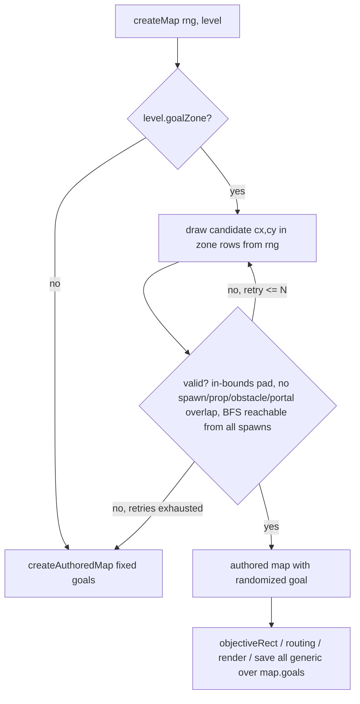
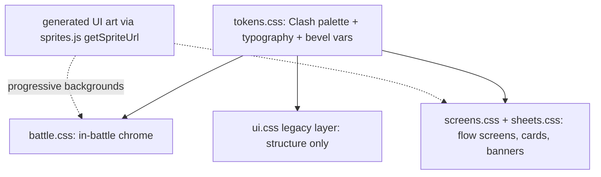

# feat: Clash Royale chrome, wall-2 art, tutorial, random crystal, balance re-verify

## Summary

Five player-facing upgrades on the 2x2-era branch: swap the wall to the user-supplied `assets/towers/wall-2.png`, restyle all DOM chrome to a Clash Royale feel (CSS-first placeholders, then up to 10 generated UI images), add a skippable scripted tutorial to the Level 1 first run, place the crystal at a seeded-random spot in the lower board per run, and re-verify all balance gates on the resulting geometry. The campaign-sim gate file itself is never modified.

---

## Requirements

**Art and rendering**

- R1. Walls render from the new wall-2 art as a padded per-cell sprite block, with the current procedural brick drawing kept as fallback when sprites are off or unloaded.
- R2. The new wall asset passes alpha/dimension QC under a contract that accepts inset-alpha sprites (its corners are transparent), and every existing asset gate stays green.

**Clash Royale chrome**

- R3. All DOM chrome (topbar, wavebar, radial ring, infocard, sheets, screens, multiselect, banners) reads as one coherent Clash Royale style system: chunky beveled buttons, gold-on-royal-blue palette, card-like panels, bouncy press feedback.
- R4. The restyle works with zero generated images (CSS placeholder skin), and upgrades progressively when generated UI art is present.
- R5. At most 10 GPT-Image-2 generations are spent on UI art, wired through the existing manifest pipeline.
- R6. `test/t15ui-contract.mjs` passes, updated in lockstep only where selectors legitimately change; hit-area minimums (44px, 60px ring items) are preserved.

**Tutorial**

- R7. First launch of Level 1 shows a scripted tutorial overlay with a visible Skip button; completing or skipping it persists so it never auto-shows again.
- R8. The tutorial never triggers in headless runs, sims, or when a campaign save exists for Level 1 (resume prompt wins).

**Crystal placement**

- R9. On levels that opt in (Level 1 first), the crystal 2x2 pad is placed at a seeded-random position within the lower portion of the board, validated for reachability, and identical across save/resume of the same run.
- R10. New runs get a fresh seed at boot so placement varies run to run; sims and tests keep their fixed seeds and stay deterministic.

**Balance**

- R11. All four balance gates pass on the final geometry: plain campaign-sim, --careless, --noupgrade, t10validate. Tuning happens on level/enemy/config data only; `test/campaign-sim.mjs` is not edited except where the plan explicitly parameterizes a hardcoded Level 1 approach-cell assertion in `test/t19-objective-routing.mjs` (a different file; campaign-sim itself stays untouched).

**Copy rule**

- R12. No em dashes in any new copy, docs, or UI text.

---

## Key Technical Decisions

- **Wall becomes a sprite-drawn padded block, not a seamless tile or autotiler:** wall-2.png has transparent corners, so each wall cell renders as its own stone block (Clash tower-block read). `drawTowers` gains a sprite branch for walls ahead of `drawConnectedWall`, which remains the no-sprite fallback. A 16-state autotiler is explicitly out of scope for this pass.
- **Wall QC uses the inset-alpha (default) category:** normalize the 512px source to a 64px `towers/wall-2-v1.png` with safe transparent padding, drop the opaque-corner `tile: true` expectation for the wall entry, and keep the old redbrick asset on disk as evidence.
- **Restyle extends the existing token cascade:** the `@layer legacy, tokens, ... ` stack in `src/ui/ui.css` already routes colors through `--ck-*` tokens in `src/ui/styles/tokens.css`. The Clash pass re-points tokens and adds component rules in `battle.css`/`screens.css`/`sheets.css`; `ui.css` legacy layer is touched only for structural needs. No parallel style system.
- **Generated UI art is background-progressive:** new manifest ids (a `UI_HINT` prompt map in `tools/gen-assets.mjs`) load through `sprites.js` and apply as CSS `background-image` via `getSpriteUrl`, mirroring the `screens.js` title-background pattern. Missing art means the CSS placeholder skin simply stays, so R4 holds.
- **Tutorial is a screens-pattern overlay gated by a standalone localStorage key:** mount in `#modal` with `lockSurface`, exact `dataset.uiState` convention preserved for the UI contract; gate on `mazecore_tutorial_l1_done_v1` mirroring the proven `hints.js` pattern (headless-safe try/catch). `services/profile.js` schema stays at v1.
- **Crystal randomization lives in `createAuthoredMap` behind a level opt-in flag:** a `goalZone` field on the level def (Level 1 first) defines the lower-band rows; placement draws from the map rng with a validate-and-retry loop (reachability via the existing BFS helpers, no overlap with spawns, props, obstacles, or the portal pad), falling back to the authored fixed goal after bounded retries. `objectiveRect`, routing, rendering, and saves already work generically off `state.map.goals`, and saves rebuild the map from `seed + levelId`, so no save-schema change.
- **Boot seed becomes time-derived for new runs only:** `src/main.js` seeds fresh runs from a time-based value instead of the constant; `CONFIG.SEED` remains the default for tests, sims, and any explicit seed path. Save/resume already persists `state.seed`.
- **Balance tuning is data-side only:** if gates drift, adjust level defs, wave tables, or CONFIG values; never weaken gate thresholds or logic.

---

## High-Level Technical Design

Crystal placement flow (directional guidance, not implementation specification):

Style system after the restyle:

---

## Implementation Units

### U1. Wall-2 asset normalization and QC wiring

- **Goal:** `wall-2.png` becomes the promoted, QC-passing runtime wall asset.
- **Requirements:** R1, R2
- **Dependencies:** none
- **Files:** `assets/towers/wall-2-v1.png` (new, normalized 64px), `tools/gen-assets.mjs`, `tools/asset-qc.mjs`, `assets/manifest.json`, `test/t19-wall2-staging.mjs` (new), `docs/art/asset-qc-report.md`
- **Approach:** downscale the 512px source to 64px with a small script (reuse the map-proof composer pattern; keep the 512px original in place as staging evidence). Manifest id `tower-wall-2` with sprite metadata, version derived from the `-v1` suffix as usual. Change the wall QC entry from the opaque-corner tile category to the inset-alpha default category.
- **Test scenarios:**
  - Normalized asset is 64x64 RGBA with alpha bounds inset from all four edges.
  - `asset-qc --all` passes with the new wall entry and all pre-existing entries.
  - Manifest regeneration (`gen-assets --list`) is idempotent and keeps `tower-wall-2` at v1.
  - `t14asset-files` covers the new file.
- **Verification:** `ASSET_QC_OK`, `PRODUCTION_ASSETS_OK`, new staging test green.

### U2. Wall sprite rendering with procedural fallback

- **Goal:** walls draw the new art per cell; procedural bricks remain the fallback.
- **Requirements:** R1
- **Dependencies:** U1
- **Files:** `src/ui/render.js`, `src/ui/sprites.js` (wall candidate chain), `test/t12render.mjs`
- **Approach:** in `drawTowers`, when `t.def.wall` and a wall sprite is loaded, draw the sprite into the exact 1x1 cell rect; otherwise call `drawConnectedWall` unchanged. Update `towerSpriteCandidates` wall chain to `tower-wall-2` first, redbrick second.
- **Test scenarios:**
  - With sprites disabled the procedural path still renders (fakedom smoke stays green).
  - Sprite branch selected when the wall def and a loaded sprite are both present.
  - Adjacent wall runs render without errors at map scale (browser check, both viewports).
- **Verification:** `RENDER_OK`, browser screenshot shows wall-2 blocks in a wall row.

### U3. Clash Royale token skin and CSS placeholder pass

- **Goal:** the whole chrome reads Clash Royale with zero images.
- **Requirements:** R3, R4, R6, R12
- **Dependencies:** none (parallel with U1/U2)
- **Files:** `src/ui/styles/tokens.css`, `src/ui/styles/battle.css`, `src/ui/styles/screens.css`, `src/ui/styles/sheets.css`, `src/ui/ui.css` (structural only), `test/t15ui-contract.mjs` (lockstep updates only), `test/ui-harness.html` (existing, verified during the restyle pass)
- **Approach:** re-point the token set to a Clash palette (deep royal blue field, saturated gold primary buttons, parchment card faces, dark navy panel borders, bold rounded display type with heavy text stroke feel via shadows). Add pressed-state squash, drop-shadow bevels, and gold-pill counters for gold/lives/wave in the topbar. Keep every selector and aria string the contract test asserts; where a legitimate rename is needed, update the test in the same commit.
- **Test scenarios:**
  - `t15ui-contract` passes; radial center at least 44px; ring items 60px with 8px gaps.
  - All 18 harness states in `test/ui-harness.html` still register.
  - No em dashes in any changed copy (grep gate).
  - Headless hud smoke via fakedom keeps passing.
- **Verification:** contract suite green plus browser review at 390x844 and 1440x900.

### U4. Generated Clash UI art set and progressive wiring

- **Goal:** spend up to 10 GPT-Image-2 generations on chrome art and wire them progressively.
- **Requirements:** R4, R5
- **Dependencies:** U3
- **Files:** `tools/gen-assets.mjs` (new `UI_HINT` map + manifest entries), `assets/ui/` outputs, `src/ui/hud.js` or per-component files (background application), `src/ui/styles/battle.css`, `src/ui/styles/screens.css`, `test/t14asset-files.mjs` coverage via manifest
- **Approach:** budget allocation, highest leverage first: (1) gold button frame, (2) blue secondary button frame, (3) parchment panel texture, (4) card frame for infocard/upgrade cards, (5) ribbon header banner, (6) victory banner, (7) defeat banner, (8) radial ring backplate, (9) topbar crest/gem cluster, (10) reserve for one retry of the worst result. Nine-slice-friendly prompts (square, border-safe). Apply via `getSpriteUrl` backgrounds after sprite load; CSS placeholder remains when null.
- **Execution note:** generate 1 and 3 first and review at UI scale before spending the rest of the budget.
- **Test scenarios:**
  - Manifest entries exist and files load (t14).
  - With generation skipped entirely, UI renders on the CSS placeholder skin with no console errors.
  - Test expectation for visual quality: browser screenshots at both viewports, user-facing review.
- **Verification:** all suites green; screenshots shared; budget log of images spent.

### U5. Tutorial overlay for Level 1 first run

- **Goal:** scripted, skippable tutorial on first Level 1 play.
- **Requirements:** R7, R8, R12
- **Dependencies:** U3 (uses the new button/card styles)
- **Files:** `src/ui/tutorial.js` (new), `src/main.js` (`enterLevel` hook), `src/ui/hud.js` (mount wiring), `src/ui/hints.js` (suppress overlap while tutorial active), `test/t20-tutorial.mjs` (new), `test/ui-harness.html` (new state), `test/t15ui-contract.mjs` (if new mount asserted)
- **Approach:** 4 to 5 steps: welcome and goal, build a wall (points at the build ring), build a tower on a 2x2 slot, start the wave, upgrade. Steps advance on the matching player action or Next; Skip is always visible and ends the tutorial immediately. Mount via the screens `_mount`/`lockSurface` pattern for the intro card, then step callouts anchored as non-blocking overlay chips so the player can actually tap the board. Gate: `bootLevel` is l1, no campaign save, localStorage flag unset, DOM present (headless-safe try/catch identical to hints.js).
- **Test scenarios:**
  - First l1 boot with clean storage: tutorial state machine activates; flag set on finish.
  - Skip at step 1 sets the flag and returns full control (game unpaused, no orphan DOM).
  - Second boot with flag set: no tutorial.
  - Boot with an existing campaign save: resume prompt shows, tutorial does not.
  - Headless/fakedom boot never throws and never activates the tutorial.
  - Step advancement fires on real actions (build wall advances step 2) and on Next.
- **Verification:** new suite green, manual browser run through both finish and skip paths.

### U6. Seeded-random crystal placement

- **Goal:** Level 1 crystal lands at a seeded-random lower-board position each new run.
- **Requirements:** R9, R10
- **Dependencies:** none (parallel), U7 consumes its output
- **Files:** `src/game/map.js` (`createAuthoredMap` placement path), `src/game/levels.js` (Level 1 `goalZone` field), `src/main.js` (time-derived new-run seed), `src/game/state.js` (only if a helper is needed), `test/t19-objective-routing.mjs` (parameterize approach-cell assertions on the actual goal), `test/t20-crystal-placement.mjs` (new), `test/t12resume.mjs` (extend for placement reproduction)
- **Approach:** `goalZone: { yMin, yMax }` on the level def (lower third for Level 1, keeping one-cell border insets). Draw candidates from the rng passed into `createMap`; validate pad bounds, overlap (portal pad, spawns, props, obstacles, checkpoints), and BFS reachability from every spawn; bounded retries then fall back to the authored goal. Placement draw happens at a fixed point in the map build sequence so a given seed always yields the same map.
- **Test scenarios:**
  - Same seed twice yields the identical goal cell; two different seeds yield at least one differing placement across a small seed sample.
  - Every sampled placement is inside the zone rows, on valid cells, and reachable from all spawns.
  - Retry exhaustion (forced by a mocked always-invalid validator) falls back to the authored goal without throwing.
  - Save then resume reproduces the crystal position exactly (seed round-trip).
  - `t19-objective-routing` passes against the actual goal rect rather than the old hardcoded cells; the four pad cells are still distance-0 equivalents.
  - Sim seed 1 and boot-style seeds both produce gate-sane maps (no guard trips in a single-level smoke).
- **Verification:** new and updated suites green; two fresh browser runs show different crystal spots.

### U7. Balance re-verification and data-side tuning

- **Goal:** all four gates pass on the final art, UI, and randomized-crystal geometry.
- **Requirements:** R11
- **Dependencies:** U2, U6
- **Files:** `src/config.js` and `src/game/levels.js` only if tuning is required; `docs/art/asset-qc-report.md` and `HANDOFF.md` for evidence
- **Approach:** run plain, --careless, --noupgrade, and t10validate. If the plain gate drifts because seed-1 crystal geometry shortens or lengthens the Level 1 route, first prefer tightening `goalZone` bounds, then wave or gold data. Never change gate thresholds, strategies, or `test/campaign-sim.mjs`.
- **Execution note:** judgment calls on which lever to pull belong to the opus-tier reviewer in ce-work.
- **Test scenarios:**
  - `CAMPAIGN_OK`, `CARELESS_OK`, `NOUPGRADE_OK`, t10validate pass, zero guard trips.
  - Full `npm test` green end to end.
- **Verification:** suite output captured in the QC report.

### U8. Integration gate, evidence, and docs

- **Goal:** single green checkpoint with updated evidence.
- **Requirements:** all
- **Dependencies:** U1 through U7
- **Files:** `docs/art/asset-qc-report.md`, `HANDOFF.md`, `test/run.mjs` (register new suites)
- **Approach:** register t19-wall2-staging, t20-tutorial, t20-crystal-placement in the runner; full `npm test`; browser composition checks at 390x844 and 1440x900 (wall art, Clash chrome, tutorial both paths, two crystal positions); update the QC report and handoff; commit per unit, push at the end. Keep `serve.err` untracked.
- **Test scenarios:** Test expectation: none, this is an evidence and registration unit; the gates themselves are the coverage.
- **Verification:** `ALL_SUITES_OK`, screenshots, pushed branch.

---

## Scope Boundaries

**Deferred to follow-up work**

- Tower action/aura/income sheet slicer contradiction (documented in `HANDOFF.md`): needs its own decision and approval; not bundled here.
- Random crystal placement for levels beyond Level 1: the mechanism is generic (`goalZone` opt-in) but enabling it per level is authored-balance work for a later pass.
- A 16-state wall autotiler if the single-block look is later judged insufficient.
- In-canvas battlefield art re-skin (tiles, towers, enemies stay as approved).

**Outside this batch**

- Hero system UI (heroes are disabled in the shipped config).
- Sound design changes.

---

## Risks and Dependencies

- The UI contract test string-matches file contents; broad CSS/class renames can silently break it. Mitigation: change selectors only with lockstep test updates in the same commit (R6).
- Seed-1 crystal geometry could make the plain gate fail for reasons unrelated to tower balance. Mitigation: `goalZone` bounds are the first tuning lever and the fallback path restores authored placement.
- GPT-Image-2 output quality for nine-slice chrome is unproven in this project. Mitigation: two-image pilot before spending the rest of the budget, CSS skin is always the floor.
- OneDrive/AV file locks have bitten asset writes before; generation outputs land under `assets/` on D: which has been safe this branch.

---

## Operational Notes

Execution runs through ce-work in tmux with tiered subagents per the standing delegation rule: haiku for mechanical edits (manifest entries, test registration, string updates), sonnet for specced feature units (U1, U2, U4, U5, U6), opus for judgment-heavy work (U3 design direction, U7 balance calls). The orchestrator plans, reviews diffs, and owns commits. Every subagent dispatch opens with the repo guard (cd D:\Claude\mazecore-td, assert expected HEAD) per the standing subagent-trap rule.
